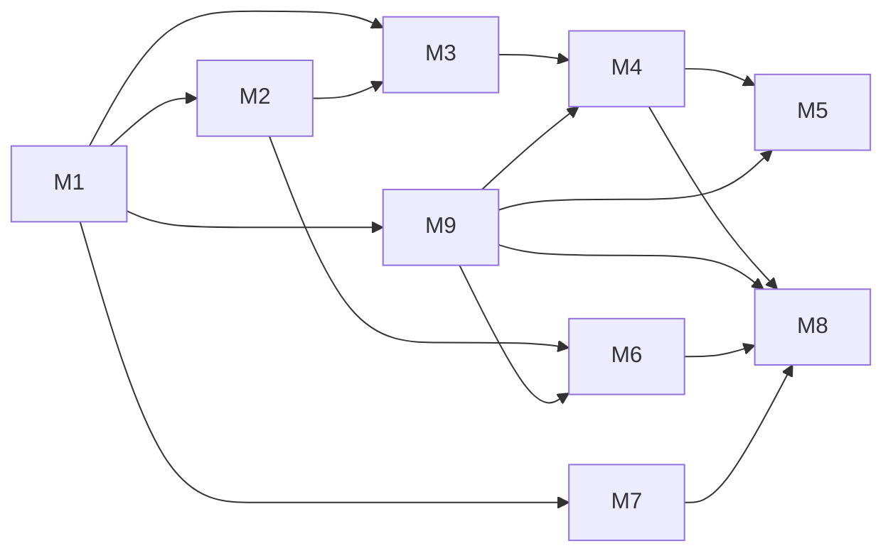
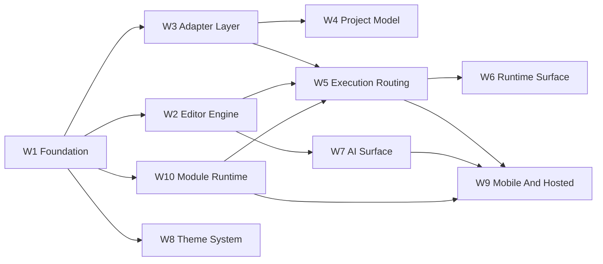

# Source Material

This file preserves the full content of planning sources imported into the current Better Plan workspace. The source labels match the Evidence ledger; old planning roots are not active navigation.

## source-001-00-milestone-index: 00 Milestone Index

```text
# Styio View Milestone Index 鈥� 2026-04-12

**Purpose:** 鍐荤粨 `styio-view` 棣栨壒瀹炴柦閲岀▼纰戙�佷緷璧栭摼鍜岄獙鏀堕棬绂侊紱鍏蜂綋浠诲姟瑙佸悇閲岀▼纰戞枃浠躲��

**Last updated:** 2026-04-12

**Status:** Active milestone batch

## 1. 鎵规�＄洰鏍�

鎶� `styio-view` 浠庘�滀粎鏈夋柟鍚戔�濇帹杩涘埌鈥滄�岄潰鏈�灏忛棴鐜� + 妯″潡瀹夸富涓� staged update 鍩虹嚎 + 杩愯�岃�嗗浘楠ㄦ灦 + AI 闈㈡澘楠ㄦ灦 + 绉诲姩绔�鍒嗗钩鍙扮瓥鐣モ�濄��

## 2. 閲岀▼纰戝垪琛�

| Milestone | File | Goal |
|-----------|------|------|
| M1 | [M1-Foundation-And-Desktop-Shell.md](./M1-Foundation-And-Desktop-Shell.md) | 鍐荤粨宸ョ▼楠ㄦ灦銆佹枃妗ｃ�丗lutter 妗岄潰澹充笌鍩虹��瀵艰埅 |
| M2 | [M2-Editor-Core.md](./M2-Editor-Core.md) | 寤虹珛鑷�鐮旀枃妗ｆā鍨嬨�佽緭鍏ャ�侀�夋嫨銆佹覆鏌撳熀鏈�鐩� |
| M3 | [M3-Semantic-Surfaces-And-Language-Bridge.md](./M3-Semantic-Surfaces-And-Language-Bridge.md) | 鍐荤粨璇�瑷�灞備骇鍝佸悎鍚屻�佽��涔夎〃闈�涓� `CLI / FFI / Cloud` adapter 妲戒綅 |
| M4 | [M4-Desktop-Compile-And-Run.md](./M4-Desktop-Compile-And-Run.md) | 妗岄潰绔�瀹屾垚淇濆瓨缂栬瘧銆佸揩鎹烽敭杩愯�屽拰璇婃柇闂�鐜� |
| M5 | [M5-Runtime-Surface.md](./M5-Runtime-Surface.md) | 浜や粯搴曢儴杩愯�岃�嗗浘銆佺嚎绋嬭建涓庡浘妯″瀷鏈�灏忛棴鐜� |
| M6 | [M6-AI-Surface.md](./M6-AI-Surface.md) | 浜や粯 IDE 鍐呭缓 AI 闈㈡澘銆乸rompt profile 涓庝笂涓嬫枃娉ㄥ叆 |
| M7 | [M7-Theme-And-Profile-System.md](./M7-Theme-And-Profile-System.md) | 浜や粯涓婚�樺垎灞傘�侀�勮�句富棰樹笌 profile 楠ㄦ灦 |
| M8 | [M8-Mobile-Runtime-And-Cloud-Path.md](./M8-Mobile-Runtime-And-Cloud-Path.md) | 浜や粯 Android 鏈�鍦颁紭鍏堛�乮OS 浜戞墽琛屼笌 Web hosted workspace 涓昏矾寰� |
| M9 | [M9-Module-Runtime-And-Staged-Hot-Update.md](./M9-Module-Runtime-And-Staged-Hot-Update.md) | 浜や粯妯″潡鎸傝浇銆佸嵏杞姐�佸垎绔�鑳藉姏鐭╅樀銆佹暟鎹�鍥炴敹涓� staged update |

## 3. 渚濊禆鍥�



## 4. 鎵规�￠棬绂�

1. 姣忎釜閲岀▼纰戦兘蹇呴』鏈夋槑纭�閫�鍑烘潯浠躲��
2. 娌℃湁瀵瑰簲 ADR 鐨勯暱鏈熸灦鏋勮竟鐣屼笉寰楁帹杩涘埌瀹炵幇銆�
3. 浠讳綍骞冲彴鎵胯�洪兘蹇呴』鑳芥槧灏勫埌 `docs/assets/workflow/TEST-CATALOG.md`銆�
```

## source-002-m1-foundation-and-desktop-shell: M1 Foundation And Desktop Shell

```text
# M1 鈥� Foundation And Desktop Shell

**Purpose:** 鍐荤粨浠撳簱楠ㄦ灦銆丗lutter 妗岄潰搴旂敤澹炽�佹ā鍧楀�夸富鍩虹��銆佸�艰埅缁撴瀯鍜屾渶灏忓紑鍙戝惊鐜�锛屼负鍚庣画鑷�鐮旂紪杈戝櫒涓庢ˉ鎺ュ眰鎻愪緵绋冲畾钀界偣銆�

**Last updated:** 2026-04-12

**Status:** In Progress

## 1. 鐩�鏍�

1. 璁╀粨搴撳叿澶囨槑纭�妯″潡杈圭晫銆�
2. 寤虹珛 Flutter 妗岄潰搴旂敤楠ㄦ灦銆�
3. 寤虹珛涓荤獥鍙ｃ�佸簳閮ㄩ潰鏉裤�佷晶鏍忓拰宸ヤ綔鍖哄�艰埅鐨勫熀鏈�甯冨眬銆�

## 2. 浠诲姟

| Task ID | Deliverable | Dependency | Exit |
|---------|-------------|------------|------|
| M1-T01 | 寤虹珛 Flutter 宸ョ▼楠ㄦ灦涓庢ā鍧楃洰褰� | none | 鑳藉湪妗岄潰鍚�鍔ㄧ┖搴旂敤 |
| M1-T02 | 瀹氫箟 `app/`, `editor/`, `runtime/`, `agent/`, `theme/` 妯″潡杈圭晫 | M1-T01 | 鐩�褰曚笌鍏ュ彛鍐荤粨 |
| M1-T03 | 寤虹珛涓荤獥鍙ｅ竷灞�锛氱紪杈戝尯銆佸簳閮ㄥ尯銆佷晶鏍忋�佺姸鎬佹爮 | M1-T01 | UI 澹冲彲瑙� |
| M1-T04 | 寤虹珛鍏ㄥ眬蹇�鎹烽敭涓庡懡浠よ矾鐢遍�ㄦ灦 | M1-T03 | 鍙�娉ㄥ唽鍛戒护浣嗚�屼负鍙�涓虹┖ |
| M1-T05 | 寤虹珛鍩虹��鐘舵�佺�＄悊鍜屽伐浣滃尯璺�鐢遍�ㄦ灦 | M1-T02 | 鍏佽�告墦寮�鍗曞伐浣滃尯 |
| M1-T06 | 寤虹珛妗岄潰寮�鍙戞ā寮忕殑鏃ュ織涓庤皟璇曢潰鏉块�ㄦ灦 | M1-T03 | 璋冭瘯杈撳嚭鍙�瑙� |
| M1-T07 | 涓哄悗缁� `dart:ffi` 棰勭暀鍘熺敓妯″潡鍔犺浇灞� | M1-T02 | 鍏ュ彛涓庣洰褰曞浐瀹� |
| M1-T08 | 寤虹珛 module host銆乵odule slot 鍜� manifest 鍔犺浇楠ㄦ灦 | M1-T02 | 妯″潡瀹夸富瀛樺湪 |
| M1-T09 | 寤虹珛骞冲彴 capability matrix 鍩虹��閰嶇疆 | M1-T08 | 涓嶅悓骞冲彴鍙�鍐冲畾妯″潡鍙�瑙佹�� |
| M1-T10 | 鍐荤粨缁熶竴瑙嗙獥鏃忥細妗岄潰绔�涓� Web 妗岄潰甯冨眬瀵归綈锛岀Щ鍔ㄧ��涓� Web 鎵嬫満甯冨眬瀵归綈 | M1-T03 | 鍚勫钩鍙颁笉鍐嶅悇鑷�鍙戞暎甯冨眬璇�涔� |

## 3. 闂ㄧ��

1. 搴旂敤鑳藉湪 macOS / Windows / Linux 涓�鑷冲皯涓�涓�妗岄潰骞冲彴鍚�鍔ㄣ��
2. 涓诲竷灞�鍙�鎵胯浇鍚庣画缂栬緫鍣ㄣ�佽繍琛岃�嗗浘鍜� AI 闈㈡澘銆�
3. 妯″潡杈圭晫涓庢枃妗ｄ竴鑷淬��
4. 鍩虹��妯″潡瀹夸富宸插瓨鍦�锛屽悗缁�鍔熻兘鍙�鎸夋ā鍧楁帴鍏ャ��

## 4. Current implementation anchor

褰撳墠浠ｇ爜鍏ュ彛锛�

1. `frontend/styio_view_app/`
2. `lib/src/app/`
3. `lib/src/editor/`
4. `lib/src/runtime/`
5. `lib/src/agent/`
6. `lib/src/theme/`
7. `lib/src/module_host/`
8. `lib/src/platform/`

褰撳墠宸茶惤鍦帮細

1. 鍏�绔�鍏变韩 Flutter 宸ョ▼楠ㄦ灦涓� bootstrap 鑴氭湰
2. 涓诲３甯冨眬锛氬伐浣滃尯渚ф爮銆佺紪杈戝尯銆佹ā鍧椾晶鏍忋�佸簳閮� surface銆佺姸鎬佹爮
3. 鍏ㄥ眬鍛戒护璺�鐢变笌蹇�鎹烽敭楠ㄦ灦
4. `ModuleManifest` 璧勪骇涓庡钩鍙� capability matrix 鍩虹嚎
5. 鍘熺敓 bridge 淇濈暀灞備笌 smoke test
6. 鏈�鏈� Flutter `3.41.6` / Dart `3.11.4` 宸插畨瑁呭苟瀹屾垚 runner bootstrap
7. `flutter test`銆乣flutter analyze`銆乣flutter build web`銆乣flutter build macos --debug` 宸查�氳繃
8. `ViewportProfile` 宸叉帴鍏ヤ富澹筹紝`Windows/Linux/macOS` 涓庡�藉睆 `Web` 缁熶竴鍒� `Desktop` 甯冨眬鏃忥紝`Android/iOS` 涓庣獎灞� `Web` 缁熶竴鍒� `Mobile` 甯冨眬鏃�
```

## source-003-m2-editor-core: M2 Editor Core

```text
# M2 鈥� Editor Core

**Purpose:** 浜や粯鑷�鐮旂紪杈戝櫒鐨勬渶灏忔牳蹇冿紝鍖呮嫭鏂囨。妯″瀷銆佸厜鏍囥�侀�夋嫨銆佹挙閿�涓庡熀纭�鏂囨湰娓叉煋銆�

**Last updated:** 2026-04-12

**Status:** In Progress

## 1. 鐩�鏍�

1. 涓嶄緷璧栦紶缁� IDE 缁勪欢鏋勫缓鍙�缂栬緫鏂囨湰鏍稿績銆�
2. 纭�淇濆悗缁� visual substitution 涓� semantic block surface 鏈夌ǔ瀹氬熀纭�銆�

## 2. 浠诲姟

| Task ID | Deliverable | Dependency | Exit |
|---------|-------------|------------|------|
| M2-T01 | 瀹氫箟 `DocumentState`銆乣SelectionState`銆佹挙閿�/閲嶅仛妯″瀷 | M1 | 鍙�琛ㄨ揪鍗曟枃妗ｇ紪杈戠姸鎬� |
| M2-T02 | 瀹炵幇鍩虹��鏂囨湰杈撳叆銆佸垹闄ゃ�佹崲琛屻�侀�夋嫨 | M2-T01 | 鍙�瀹屾垚鍩虹��褰曞叆 |
| M2-T03 | 瀹炵幇澶氳�屽竷灞�涓庢粴鍔ㄦā鍨� | M2-T01 | 鏂囨湰鍙�姝ｇ‘婊氬姩 |
| M2-T04 | 瀹炵幇妗岄潰蹇�鎹烽敭锛氫繚瀛樸�佽繍琛屻�佸�艰埅鍩虹��楠ㄦ灦 | M1-T04 | 蹇�鎹烽敭鍙�琚�鍒嗗彂 |
| M2-T05 | 瀹炵幇榧犳爣/閿�鐩樺厜鏍囩Щ鍔ㄥ拰閫夋嫨鎵╁睍 | M2-T02 | 鍏夋爣璇�涔夌ǔ瀹� |
| M2-T06 | 瀹氫箟缂栬緫鍣ㄦ覆鏌撳眰锛氭枃鏈�灞傘�佽�呴グ灞傘�乷verlay 灞� | M2-T03 | 鍚庣画瑁呴グ鍙�鎻掑叆 |
| M2-T07 | 寤虹珛 source buffer fidelity 娴嬭瘯鍩虹嚎 | M2-T02 | 鏂囨湰鎿嶄綔涓嶇牬鍧忔簮鐮� |
| M2-T08 | 鏄庣‘鍏变韩鏍稿績妗嗘灦涓庡垎绔�娓叉煋/浜や簰璋冧紭鍒嗗眰 | M1 | 妗岄潰涓庣Щ鍔ㄥ叡浜�鏍稿績妯″瀷 |

## 3. 闂ㄧ��

1. 鍗曟枃妗ｈ緭鍏ャ�佸垹闄ゃ�佹挙閿�/閲嶅仛鍙�鐢ㄣ��
2. 鍏夋爣銆侀�夋嫨鍜屾粴鍔ㄧǔ瀹氥��
3. 浠ｇ爜浠嶇劧鏄�绾�鏂囨湰瀛樺偍锛屾湭寮曞叆浠讳綍婧愮爜绾у浘褰㈡浛鎹�銆�
4. 妗岄潰涓庣Щ鍔ㄧ��鍏变韩鍚屼竴濂楁牳蹇冩枃妗ｆā鍨嬨��

## 4. Current implementation anchor

褰撳墠浠ｇ爜鍏ュ彛锛�

1. `frontend/styio_view_app/lib/src/editor/document_state.dart`
2. `frontend/styio_view_app/lib/src/editor/selection_state.dart`
3. `frontend/styio_view_app/lib/src/editor/editor_render_layers.dart`
4. `frontend/styio_view_app/lib/src/editor/editor_controller.dart`
5. `frontend/styio_view_app/lib/src/editor/editor_surface.dart`

褰撳墠宸茶惤鍦帮細

1. `DocumentState`銆乣SelectionState` 涓庡熀纭�鎾ら攢/閲嶅仛蹇�鐓ф爤
2. `EditorRenderPlan` 涓夊眰楠ㄦ灦锛歚text / decoration / overlay`
3. 鍏变韩 `EditorSessionController`
4. 宸ヤ綔鍖烘枃浠跺垏鎹㈡椂鐨勬枃妗� seed 瑁呰浇
5. 涓诲３鍐呭彲瑙佺殑 source buffer 鍒嗗眰棰勮��
6. 棰勮�堝眰宸叉寜 token range 閫愯�屾覆鏌擄紝骞惰兘鎵胯浇 inline widget span
7. 妗岄潰閿�鐩樿緭鍏ャ�乣Backspace/Delete/Enter/Tab`銆佹柟鍚戦敭涓� `Home/End` 宸叉帴鍏�
8. 鏂囦欢鍒囨崲鏃剁殑鏂囨。鍐呭瓨缂撳瓨宸叉帴鍏ワ紝褰撳墠浼氳瘽鍐呬笉浼氬洜鍒囨枃浠朵涪澶辩紪杈戠粨鏋�
9. `Shift + 鏂瑰悜閿�/Home/End` 鐨勫熀纭�閫夋嫨鎵╁睍宸叉帴鍏ワ紝骞舵湁閫夊尯楂樹寒
10. `Save` 宸叉帴鍏ヨ法绔� `WorkspaceDocumentStore`锛屽綋鍓嶄负 `native file system > web shared_preferences`
11. 榧犳爣鎷栨嫿閫夊尯宸叉帴鍏ワ紝骞跺凡鐢� widget smoke test 瑕嗙洊
12. 缂栬緫鍣ㄩ潰鏉垮凡璺熼殢缁熶竴瑙嗙獥鏃忚嚜閫傚簲瀵嗗害鏀剁缉锛岄伩鍏嶆�岄潰/绉诲姩鍏辩敤澹虫椂鐨勭獎楂樿�嗗彛婧㈠嚭
13. 缂栬緫鍣ㄥ唴閮� `source preview + language inspector` 宸叉敼涓鸿窡闅� `ViewportProfile`锛屼笉鍐嶆寜绾�瀹藉害鑷�琛屽垏鎹㈡�岄潰/绉诲姩璇�涔�
```

## source-004-m3-semantic-surfaces-and-language-bridge: M3 Semantic Surfaces And Language Bridge

```text
# M3 鈥� Semantic Surfaces And Adapter Contracts

**Purpose:** 鍐荤粨璇�瑷�灞備骇鍝佸悎鍚屻�乤dapter 妲戒綅鍜岃��涔夎〃闈�锛涘厛璁╃紪杈戝櫒鍥寸粫浜у搧鍚堝悓绋冲畾锛屽啀鏇挎崲鐪熷疄涓婃父瀹炵幇銆�

**Last updated:** 2026-04-12

**Status:** In Progress

## 1. 鐩�鏍�

1. 寤虹珛璇�瑷�灞� adapter 鍚堝悓涓庡疄鐜版Ы浣嶃��
2. 璁╃紪杈戝櫒鑳芥牴鎹� token 涓� block 鑼冨洿鍋氭樉绀哄眰鏇挎崲鍜屽潡琛ㄩ潰瑁呴グ銆�
3. 鍐荤粨 token highlighting銆乻emantic highlighting銆乨iagnostics銆乫ormatting 鐨勮亴璐ｈ竟鐣屻��
4. 寤虹珛 `LanguageServiceAdapter` 涓� `AdapterCapabilitySnapshot`銆�

## 2. 浠诲姟

| Task ID | Deliverable | Dependency | Exit |
|---------|-------------|------------|------|
| M3-T01 | 鍐荤粨 `LanguageServiceAdapter` 浜у搧鍚堝悓 | M1 | 鍚堝悓 SSOT 鍐荤粨 |
| M3-T02 | 瀹氫箟 `TokenSpan / SemanticSpan / Diagnostic / TextEdit / CompletionItem / HoverPayload` 鍚堝悓 | M3-T01 | 璇�瑷�鏈嶅姟鍗忚��鍐荤粨 |
| M3-T03 | 寤虹珛 `CLI / FFI / Cloud` 涓夌被 adapter 鐨勮兘鍔涘揩鐓� | M3-T01 | capability gap 缁熶竴琛ㄨ揪 |
| M3-T04 | 寤虹珛 Flutter adapter 娑堣垂灞� | M3-T01 | Flutter 涓荤嚎涓嶄緷璧栦笂娓稿唴閮ㄥ疄鐜� |
| M3-T05 | 纭�绔� `linter` 鍙�璐熻矗 diagnostics / fix锛屼笉璐熻矗鍩虹��楂樹寒 | M3-T02 | 缂栬緫鍣ㄦ枃鏈�灞備笉渚濊禆 linter 鎵嶈兘鐫�鑹� |
| M3-T06 | 瀹炵幇 `->` 鐨� visual substitution | M2 | 鏄剧ず鏇挎崲涓嶆敼鍐欐簮鐮� |
| M3-T07 | 瀹炵幇 `|>` 鐨� visual substitution | M2 | 鏄剧ず涓庡厜鏍囨槧灏勬�ｇ‘ |
| M3-T08 | 浠� block ranges 瀹炵幇鍑芥暟浣撶伆搴曞渾瑙掑潡 | M3-T02 | 鍧楄〃闈�涓庤��涔夎竟鐣屼竴鑷� |
| M3-T09 | 瀹氫箟鏈�灏忓彲缂栬瘧鍗曞厓璁＄畻鎺ュ彛 | M3-T04 | 鍚庣画缂栬瘧瑙﹀彂鍙�娑堣垂 |
| M3-T10 | 瀹炵幇 substitution 鐢ㄦ埛寮�鍏� | M2 / M3-T06 | 鍏抽棴鍚庢仮澶嶅師濮嬫枃鏈�鏄剧ず |
| M3-T11 | 寤虹珛 substitution 寮�/鍏虫�ц兘瀵规瘮鍩虹嚎 | M3-T10 | 鍙�姣旇緝涓ょ�嶆ā寮忔�ц兘 |

## 3. 闂ㄧ��

1. 鍒嗘瀽缁撴灉鍙�绋冲畾杩涘叆 Flutter銆�
2. 鍩虹��楂樹寒鐢� token / semantic 灞傞┍鍔�锛岃�屼笉鏄�鐢� linter 鍐冲畾銆�
3. `->` 涓� `|>` 鐨勫浘褰㈡浛鎹�涓嶄細姹℃煋鏂囦欢鍐呭�广��
4. 鍑芥暟鍧楄〃闈㈢敱璇�涔夎竟鐣岄┍鍔�锛屼笉渚濊禆绾�姝ｅ垯瑙勫垯銆�
5. substitution 鍙�琚�鐢ㄦ埛鏄惧紡鍏抽棴锛屼笖鍏抽棴鍚庢�ц兘鍩虹嚎鍙�娴嬨��
6. `CLI / FFI / Cloud` 浠讳竴璺�寰勮ˉ榻愬悗锛屽彧鏇挎崲 adapter 瀹炵幇锛屼笉閲嶆瀯 UI銆�

## 4. Current implementation anchor

褰撳墠浠ｇ爜鍏ュ彛锛�

1. `frontend/styio_view_app/lib/src/integration/adapter_contracts.dart`
2. `frontend/styio_view_app/lib/src/language/language_contract.dart`
3. `frontend/styio_view_app/lib/src/language/styio_language_service.dart`
4. `frontend/styio_view_app/lib/src/language/simple_styio_language_service.dart`
5. `frontend/styio_view_app/lib/src/editor/editor_controller.dart`
6. `frontend/styio_view_app/lib/src/editor/editor_surface.dart`

褰撳墠宸茶惤鍦帮細

1. `TokenSpan / SemanticSpan / Diagnostic / FormattingEdit / CompletionItem / HoverPayload` 鏁版嵁鍚堝悓
2. 鏈�鍦� `SimpleStyioLanguageService` skeleton
3. `EditorSessionController` 鍐呭缓鍒嗘瀽缁撴灉鍒锋柊閾捐矾
4. 缂栬緫鍣ㄩ潰鏉夸腑鐨� token / semantic / diagnostic / formatting 鍒嗗眰棰勮��
5. `AdapterCapabilitySnapshot` 宸叉垚涓轰富澹崇殑涓�绛夌姸鎬�
5. `->` 涓� `|>` 宸插湪 Flutter 缂栬緫鍣ㄩ�勮�堜腑浣滀负 inline glyph 娓叉煋
6. 鍑芥暟 block range 宸叉槧灏勬垚鐏板簳鍦嗚�掕��涔夎〃闈㈠�瑰櫒
7. widget smoke test 宸茶�嗙洊 glyph 棰勮�堝瓨鍦ㄦ��
8. 缂栬緫鍣ㄥ唴閮� language inspector 宸叉帴鍏� `ViewportProfile`锛屽�藉睆 `iOS/Android` 浠嶄繚鎸� mobile 璇�涔夊拰鍫嗗彔甯冨眬
9. widget smoke test 宸茶�嗙洊 `desktop family / mobile family / wide iOS still mobile` 涓夋潯璺�寰�
10. language inspector 宸插垎鍖栦负 `desktop card stack / mobile section tabs` 涓ゅ�楄〃鐜帮紝diagnostics銆乻emantic blocks銆乭over銆乧ompletion銆乫ormatting 鍧囨湁鐙�绔� section
11. active line 宸叉帴鍏� inline language feedback锛岀洿鎺ュ湪婧愮爜娴佷腑灞曠ず diagnostics銆乭over銆乧ompletion 鎴� caret context
12. inline language feedback 鍜� language inspector 閮藉凡鏀�鎸佺洿鎺ュ簲鐢� completion / formatting action锛屽紑濮嬩粠鈥滃垎鏋愬睍绀衡�濊浆鍚戔�滃彲鎿嶄綔鐨勮��瑷�闈㈡澘鈥�
13. diagnostics 宸叉帴鍏ユ渶灏� quick-fix 鍥炶矾锛屽綋鍓嶆敮鎸� `missing assignment / stray brace / unclosed block` 涓夌被鍩虹��淇�澶�
14. 鍏夋爣鎵�鍦� token 宸叉帴鍏ユ�ｆ枃楂樹寒涓� token context 灞曠ず锛宧over / completion 寮�濮嬬湡姝ｅ洿缁曞叿浣� token 鑰屼笉鏄�鍙�鍥寸粫 active line
```

## source-005-m4-desktop-compile-and-run: M4 Desktop Compile And Run

```text
# M4 鈥� Desktop Compile And Run

**Purpose:** 鍦ㄦ�岄潰绔�浜や粯淇濆瓨缂栬瘧銆佸揩鎹烽敭杩愯�屻�佽瘖鏂�鍥炴寚鍜屾渶灏忚繍琛岄棴鐜�銆�

**Last updated:** 2026-04-12

**Status:** In Progress

## 1. 鐩�鏍�

1. 鐢ㄦ埛淇濆瓨鎴栨樉寮忚繍琛屾椂锛屽彲缂栬瘧骞舵墽琛屾渶灏忓悎娉曞崟鍏冦��
2. 缂栬瘧鍜岃繍琛岀粨鏋滆兘鍥炴祦鍒扮紪杈戝櫒涓庡簳閮ㄩ潰鏉裤��

## 2. 浠诲姟

| Task ID | Deliverable | Dependency | Exit |
|---------|-------------|------------|------|
| M4-T01 | 瀹氫箟淇濆瓨鍚庤嚜鍔ㄧ紪璇戠瓥鐣ヤ笌閰嶇疆椤� | M3-T07 | 琛屼负鍙�閰嶇疆 |
| M4-T02 | 鎺ュ叆 `Ctrl + Enter` 鎴栧钩鍙扮瓑鏁堣繍琛屽懡浠� | M1-T04 | 蹇�鎹烽敭鑳借Е鍙戣繍琛� |
| M4-T03 | 鎵撻�氭�岄潰鏈�鍦� compile API | M3 | 鑳借繑鍥炵紪璇戞垚鍔�/澶辫触 |
| M4-T04 | 鎵撻�氭�岄潰鏈�鍦� run API | M4-T03 | 鑳借繍琛屾渶灏忕ず渚� |
| M4-T05 | 鎶� diagnostics 鏄剧ず鍥炵紪杈戝櫒涓庡簳閮ㄩ潰鏉� | M3-T02 | 閿欒��鍙�瀹氫綅 |
| M4-T06 | 瀹氫箟 compile / run session 鐘舵�佹ā鍨� | M4-T03 | UI 鑳借窡韪�鎵ц�岀姸鎬� |
| M4-T07 | 寤虹珛鏃ュ織涓� stdout/stderr 闈㈡澘 | M4-T04 | 杩愯�岃緭鍑哄彲瑙� |
| M4-T08 | 寤虹珛 scratch single-file route 涓� project preview-only route 鍒嗘祦 | M3 | capability gap 娓呮櫚鍙�瑙� |
| M4-T09 | 鍦ㄥ伐浣滃尯涓� runtime 闈㈡澘灞曠ず workflow / compiler handshake / route summary | M4-T06 | 鐢ㄦ埛鑳界洿鎺ョ湅鍒板綋鍓嶈矾鐢变笌闄愬埗 |

## 3. 闂ㄧ��

1. 鐢ㄦ埛鍙�浠庢�岄潰绔�缂栬緫銆佷繚瀛樸�佽繍琛屼竴涓� Styio 鏈�灏忓崟鍏冦��
2. 缂栬瘧澶辫触鏃讹紝璇婃柇鑳藉洖鎸囧埌褰撳墠浠ｇ爜浣嶇疆銆�
3. 杩愯�岀姸鎬佸彲鍙嶉�堢粰 UI銆�
4. project-backed route 鍦� compile-plan live consumer 鍙戝竷鍓嶅繀椤绘槑纭�鏄剧ず preview-only锛岃�屼笉鏄�浼�瑁呮垚鍙�杩愯�屻��

## 4. Current implementation anchor

褰撳墠浠ｇ爜鍏ュ彛锛�

1. `frontend/styio_view_app/lib/src/integration/execution_adapter.dart`
2. `frontend/styio_view_app/lib/src/integration/execution_adapter_io.dart`
3. `frontend/styio_view_app/lib/src/integration/execution_route_summary.dart`
4. `frontend/styio_view_app/lib/src/runtime/runtime_surface.dart`
5. `frontend/styio_view_app/lib/src/app/layout/styio_shell_scaffold.dart`

褰撳墠宸茶惤鍦帮細

1. scratch single-file CLI route
2. iOS cloud-only blocked route
3. project-backed preview-only route
4. `ExecutionSession` 鐘舵�佹ā鍨嬩笌 runtime/debug 鍥炴祦
5. workspace 渚ф爮閲岀殑 `Project Workflow` 鍜� `Compiler Handshake` 鍗＄墖
6. workspace 渚ф爮閲岀殑 `Required Handoffs` 鍗＄墖锛岀敤浜у搧璇�瑷�鏄庣‘ `styio` / `pafio` 灏氭湭浜や粯鐨� machine contract
```

## source-006-m5-runtime-surface: M5 Runtime Surface

```text
# M5 鈥� Runtime Surface

**Purpose:** 寤虹珛搴曢儴杩愯�岃�嗗浘鍖恒�佷簨浠舵祦鍗忚��鍜岀嚎绋嬭建/绠�鍖栧浘妯″瀷鐨勬渶灏忛棴鐜�銆�

**Last updated:** 2026-04-12

**Status:** In Progress

## 1. 鐩�鏍�

1. 鐢ㄦ埛杩愯�岀▼搴忓悗鍙�浠ュ湪搴曢儴鐪嬪埌缁撴瀯鍖栬繍琛岃�嗗浘銆�
2. 杩愯�岃�嗗浘鍙�瑕嗙洊褰撳墠宸茶兘鏄庣‘琛ㄨ揪鐨勮��涔夊瓙闆嗐��

## 2. 浠诲姟

| Task ID | Deliverable | Dependency | Exit |
|---------|-------------|------------|------|
| M5-T01 | 瀹氫箟 `RuntimeEvent` 鏈�灏忓崗璁� | M4 | 浜嬩欢妯″瀷鍐荤粨 |
| M5-T02 | 瀹氫箟 `RuntimeSurfaceFeatureEntry` 涓� registry schema | M5-T01 / M9-T01 | 鍙�澹版槑宸叉敮鎸佺殑鍙�瑙嗗寲瀛愰泦 |
| M5-T03 | 瀹氫箟绾跨▼杞� `ThreadLaneState` 鏁版嵁妯″瀷 | M5-T01 | 鍙�琛ㄨ揪骞惰�屾墽琛岃建杩� |
| M5-T04 | 瀹氫箟绠�鍖栧浘 `RuntimeGraphNode/Edge` 妯″瀷 | M5-T01 | 鍙�琛ㄨ揪鐘舵�佹垨娴佺▼ |
| M5-T05 | 瀹炵幇搴曢儴杩愯�岄潰鏉块�ㄦ灦 | M1-T03 | 闈㈡澘鍙�鎵胯浇瑙嗗浘 |
| M5-T06 | 瀹炵幇绾跨▼杞� UI | M5-T03 | 鍙�鏄剧ず澶氭潯骞惰�岀嚎 |
| M5-T07 | 瀹炵幇鏈�灏忓浘瑙嗗浘 UI | M5-T04 | 鍙�鏄剧ず绠�鍖栬妭鐐�/杈� |
| M5-T08 | 鍚�鍔ㄦ椂鎸夊凡瑁呮ā鍧楀姞杞� runtime surface feature registry | M5-T02 / M9-T05 | 鍏ュ彛鍒楄〃涓庡凡瑁呮ā鍧椾竴鑷� |
| M5-T09 | 寤虹珛鈥滀粎瀵规敮鎸佸瓙闆嗗彲瑙嗗寲鈥濈殑鏄惧紡鎻愮ず | M5-T02 / M5-T07 | 涓嶄吉閫犺��涔� |
| M5-T10 | 璁� runtime surface 璺熼殢缁熶竴瑙嗙獥鏃忓垏鎹㈡�岄潰/绉诲姩鎺掔増 | M1-T10 / M5-T05 | 搴曢儴杩愯�岄潰鏉夸笉鍐嶈劚绂讳富澹冲竷灞�璇�涔� |

## 3. 闂ㄧ��

1. 杩愯�屼竴涓�鏈�灏忕▼搴忓悗锛屽簳閮ㄩ潰鏉挎湁缁撴瀯鍖栧彲瑙嗗弽棣堛��
2. 涓嶆敮鎸佺殑璇�涔夊繀椤绘槑纭�閫�鍖栵紝鑰屼笉鏄�鍋囪�呭凡瑕嗙洊銆�
3. 鍚�鍔ㄥ悗鐨勫彲瑙嗗寲鍏ュ彛鍒楄〃蹇呴』涓庡凡瑁呮ā鍧楀拰 capability matrix 涓�鑷淬��

## 4. Current implementation anchor

褰撳墠浠ｇ爜鍏ュ彛锛�

1. `frontend/styio_view_app/lib/src/runtime/runtime_surface.dart`
2. `frontend/styio_view_app/lib/src/runtime/debug_console_surface.dart`
3. `frontend/styio_view_app/lib/src/app/layout/styio_shell_scaffold.dart`

褰撳墠宸茶惤鍦帮細

1. `RuntimeSurface` 宸叉寜 `ViewportProfile` 鍒囨崲妗岄潰/绉诲姩涓ゅ�楀崰浣嶆帓鐗�
2. runtime 鐩稿叧妯″潡杩囨护宸茬粡浠庡瓧绗︿覆鍖归厤鍒囧埌 `ModuleSlot` 鏄惧紡鍒ゅ畾
3. `DebugConsoleSurface` 宸叉帴鍏ユ�岄潰/绉诲姩涓ゅ�� header 鍜屾憳瑕佺粨鏋�
4. 搴曢儴 tab 鍒囨崲浠嶇敱缁熶竴 `ShellModel.activeBottomTab` 椹卞姩
```

## source-007-m6-ai-surface: M6 AI Surface

```text
# M6 鈥� AI Surface

**Purpose:** 鎶� AI 鍗忎綔闈㈡澘鍋氭垚 IDE 涓�绛夎兘鍔涳紝鏀�鎸佽嚜瀹氫箟 prompt銆佷笂涓嬫枃娉ㄥ叆銆乸rovider adapter 鍜屽�栨帴缁勪欢鎺ュ叆銆�

**Last updated:** 2026-04-12

**Status:** In Progress

## 1. 鐩�鏍�

1. 鐢ㄦ埛鏃犻渶绂诲紑 IDE 鍗冲彲涓� coding agent 浜や簰銆�
2. prompt profile銆佹枃浠朵笂涓嬫枃銆佽瘖鏂�鍜岃繍琛屾�佷笂涓嬫枃鍙�娉ㄥ叆銆�
3. 鍦ㄦ病鏈夋湰鍦� agent 鍜屾病鏈変簯 sync 缁勪欢鐨勬儏鍐典笅锛屽熀纭� AI 闈㈡澘浠嶅彲宸ヤ綔銆�

## 2. 浠诲姟

| Task ID | Deliverable | Dependency | Exit |
|---------|-------------|------------|------|
| M6-T01 | 瀹氫箟 `AgentSession` 涓� provider 鎶借薄 | M1 | 鏈�鍦�/浜戠��鎺ュ彛缁熶竴 |
| M6-T02 | 瀹炵幇搴曢儴鎴栦晶杈� AI 闈㈡澘楠ㄦ灦 | M1-T03 | 闈㈡澘鍙�鐢� |
| M6-T03 | 璁捐�� prompt profile 鏁版嵁妯″瀷 | M6-T01 | prompt 鍙�鎸佷箙鍖� |
| M6-T04 | 娉ㄥ叆褰撳墠鏂囦欢銆侀�夊尯銆佽瘖鏂�涓婁笅鏂� | M4-T05 | agent 鏀跺埌 IDE 涓婁笅鏂� |
| M6-T05 | 娉ㄥ叆杩愯�屾�佷笂涓嬫枃 | M5 | agent 鍙�璇绘墽琛屼俊鎭� |
| M6-T06 | 璁捐�℃湰鍦� provider 涓庝簯 provider 閫夋嫨閫昏緫 | M6-T01 | provider 鍙�鍒囨崲 |
| M6-T07 | 涓哄悗缁�琛ヤ竵/浠ｇ爜寤鸿��棰勭暀搴旂敤鎺ュ彛 | M6-T04 | UI 鑳芥壙杞藉缓璁�缁撴灉 |
| M6-T08 | 瀹氫箟 OpenAI-compatible cloud provider adapter | M6-T01 | 鍙�鎺ラ�氭爣鍑嗗吋瀹圭��鐐� |
| M6-T09 | 棰勭暀鏈�鍦板�栨帴 agent bridge | M6-T01 | 鏈�鍦� agent 鍙�鍚庢帴鍏� |
| M6-T10 | 瀹氫箟 `ProfileSyncAdapter` 涓� local-only fallback | M6-T03 | 鏃� sync 鏃朵篃鍙�鐢� |
| M6-T11 | 鍑嗗�囬�勪笂绾� OpenRouter 绫� provider 閰嶇疆浣� | M6-T08 | 棰勪笂绾垮彲鐩存帴鎺ヤ簯 provider |
| M6-T12 | 璁� AI surface 璺熼殢缁熶竴瑙嗙獥鏃忓垏鎹㈡�岄潰/绉诲姩鎺掔増 | M1-T10 / M6-T02 | AI 闈㈡澘涓嶅啀涓庝富澹冲竷灞�鑴辫妭 |

## 3. 闂ㄧ��

1. AI 闈㈡澘涓嶅啀鏄�澶栭儴閾炬帴锛岃�屾槸 IDE 鍐呭缓闈㈡澘銆�
2. 鐢ㄦ埛鍙�缂栬緫鍜屼繚瀛橀�勮緭鍏� prompt銆�
3. agent 鑷冲皯鑳借�诲彇褰撳墠宸ヤ綔涓婁笅鏂囥��
4. 鏃犳湰鍦� agent 鍜屾棤 sync 缁勪欢鏃讹紝鍩虹�� AI 闈㈡澘浠嶄笉澶辨晥銆�

## 4. Current implementation anchor

褰撳墠浠ｇ爜鍏ュ彛锛�

1. `frontend/styio_view_app/lib/src/agent/agent_surface.dart`
2. `frontend/styio_view_app/lib/src/app/layout/styio_shell_scaffold.dart`

褰撳墠宸茶惤鍦帮細

1. `AgentSurface` 宸叉寜 `ViewportProfile` 鍒囨崲妗岄潰/绉诲姩涓ゅ�楁帓鐗�
2. agent 鐩稿叧妯″潡杩囨护宸插垏鍒� `ModuleSlot.agentSurface / cloudRuntime`
3. iOS cloud-first 鍚堣�勮矾寰勫拰 desktop local-bridge 棰勭暀宸茬粡杩涘叆 UI 鍗犱綅缁撴瀯
```

## source-008-m7-theme-and-profile-system: M7 Theme And Profile System

```text
# M7 鈥� Theme And Profile System

**Purpose:** 寤虹珛缁嗙矑搴︿富棰樼郴缁熷拰鐢ㄦ埛 profile 楠ㄦ灦锛屼娇缂栬緫鍣ㄣ�佽繍琛岃�嗗浘鍜� AI 闈㈡澘鍏峰�囩粺涓�浣嗗彲灞�閮ㄨ�嗗啓鐨勯�庢牸鑳藉姏銆�

**Last updated:** 2026-04-12

**Status:** Planned

## 1. 鐩�鏍�

1. 鎻愪緵甯歌�� IDE 涓婚�橀�勮�俱��
2. 鏀�鎸� token銆佽��涔夊潡銆侀潰鏉裤�佽繍琛屽浘鍖哄拰 agent 闈㈡澘鐨勫垎灞傞厤鑹层��
3. 涓哄悗缁�浜� profile 鍚屾�ョ暀鎺ュ彛銆�
4. 鍦ㄦ病鏈� sync 缁勪欢鏃朵繚鎸佸畬鏁存湰鍦� profile 妯″紡銆�

## 2. 浠诲姟

| Task ID | Deliverable | Dependency | Exit |
|---------|-------------|------------|------|
| M7-T01 | 瀹氫箟 `ThemeProfile` 鏁版嵁妯″瀷 | M1 | 鍒嗗眰瀛楁�靛喕缁� |
| M7-T02 | 鍑嗗�囬�栨壒涓婚�橀�勮�� | M7-T01 | 鑷冲皯 3 濂楅�勮�� |
| M7-T03 | 鏀�鎸佺紪杈戝櫒 token 灞備富棰� | M3 | 瑙嗚�夋浛鎹㈠彲缁ф壙涓婚�� |
| M7-T04 | 鏀�鎸� semantic block surface 涓婚�� | M3-T06 | 鍧楄〃闈㈠彲瀹氬埗 |
| M7-T05 | 鏀�鎸� runtime surface 涓� AI 闈㈡澘涓婚�� | M5 / M6 | 闈㈡澘涓婚�樺彲缁熶竴 |
| M7-T06 | 鎻愪緵鐢ㄦ埛灞�閮ㄨ�嗗啓鍏ュ彛 | M7-T01 | 鍙�淇�鏀归儴鍒嗕富棰橀」 |
| M7-T07 | 涓� profile 鍚屾�ラ�勭暀搴忓垪鍖栨牸寮� | M7-T01 | 鍚庣画浜戝悓姝ュ彲鎺ュ叆 |
| M7-T08 | 瀹氫箟 local profile store 涓� cloud mirror 鐨勫垎灞傚叧绯� | M7-T07 / M6-T10 | sync 缁勪欢鍙�鐙�绔嬫寕杞� |

## 3. 闂ㄧ��

1. 涓婚�橀�勮�惧彲鍒囨崲銆�
2. 鐢ㄦ埛鍙�鍋氱粏绮掑害瑕嗗啓銆�
3. 鍚勪釜 UI 闈㈠眰涓嶄細鍏变韩涓�濂椾笉鍙�鎷嗗垎鐨勯厤鑹查厤缃�銆�
4. 鏈�鎸傝浇 sync 缁勪欢鏃讹紝profile 浠嶈兘瀹屾暣璇诲啓鍦ㄦ湰鍦般��
```

## source-009-m8-mobile-runtime-and-cloud-path: M8 Mobile Runtime And Cloud Path

```text
# M8 鈥� Mobile Runtime And Cloud Path

**Purpose:** 寤虹珛绉诲姩绔�涓撳睘浜や簰涓庝簯鎵ц�岃矾寰勶紝瑕嗙洊 Android 鏈�鍦颁紭鍏堛�乮OS 浜戞墽琛屼富璺�寰勩�乄eb hosted workspace 鍜岀Щ鍔ㄧ��杈撳叆棰勬祴 agent 楠ㄦ灦銆�

**Last updated:** 2026-04-12

**Status:** Planned

## 1. 鐩�鏍�

1. 绉诲姩绔�涓嶇収鎼�妗岄潰浜や簰銆�
2. Android 鍏峰�囨湰鍦颁紭鍏堣矾寰勩��
3. iOS 鍏峰�囦簯鎵ц�屼富璺�寰勩��
4. 绉诲姩绔� pipeline selector 涓庤緭鍏ラ�勬祴 agent 鏈夊熀纭�楠ㄦ灦銆�
5. iOS 涓嶆毚闇叉湰鍦扮紪璇戞ā鍧楀叆鍙ｃ��
6. Android 鏈�鍦拌繍琛屾ā鍧椾綋绉�鎺у埗鍦ㄥ綋鍓嶆帴鍙楅�勭畻 `<= 50 MB`銆�
7. Web 绔�鍏峰�� hosted workspace 鐨勫叧闂�銆佸�煎嚭涓庝繚鐣欑獥鍙ｈ�勫垯銆�

## 2. 浠诲姟

| Task ID | Deliverable | Dependency | Exit |
|---------|-------------|------------|------|
| M8-T01 | 瀹氫箟绉诲姩绔�浜や簰妯″瀷涓庢墜鍔挎槧灏� | M2 | 涓庢�岄潰娓呮櫚鍒嗗眰 |
| M8-T02 | 璁捐�� Android 鏈�鍦� runtime 妯″潡鎺ュ叆鏂规�� | M4 / M9 | Android 鏈�鍦拌矾寰勫喕缁� |
| M8-T03 | 璁捐�� iOS 浜戞墽琛屽伐浣滄祦涓庝粎浜戞ā鍧楃煩闃� | M4 / M9 | iOS 浜戞墽琛屼富璺�寰勫喕缁� |
| M8-T04 | 璁捐�＄Щ鍔ㄧ�� pipeline selector 闀挎寜婊氬姩浜や簰 | M3-T07 | 绫诲瀷瀹夊叏鍊欓�夊彲婊氬姩閫夋嫨 |
| M8-T05 | 寤虹珛绉诲姩绔�杈撳叆棰勬祴 agent 楠ㄦ灦 | M6 | 鏈�鍦�/浜戠��杈撳叆杈呭姪鍙�鎻掑叆 |
| M8-T06 | 璁捐�＄�荤嚎/鍦ㄧ嚎鑳藉姏鍒囨崲鎻愮ず | M8-T02 / M8-T03 | 鐢ㄦ埛鐭ラ亾褰撳墠杩愯�岃矾寰� |
| M8-T07 | 纭�淇� iOS 瀹㈡埛绔�涓嶆毚闇叉湰鍦扮紪璇戝叆鍙� | M8-T03 | iOS UI 涓庢ā鍧楃煩闃典竴鑷� |
| M8-T08 | 寤虹珛 Android 鏈�鍦拌繍琛屾ā鍧椾綋绉�棰勭畻闂ㄧ�� | M8-T02 | 鏋勫缓浜х墿鍙�妫�鏌� `<= 50 MB` |
| M8-T09 | 寤虹珛绉诲姩绔�鍩虹�� e2e 楠屾敹娓呭崟 | M8 | 鑳芥槧灏勫埌娴嬭瘯鐩�褰� |
| M8-T10 | 鍐荤粨 iOS 鏈�鍚庝笂绾夸笌 App Store 鍚堣�勫熀绾� | M8-T03 / M9-T02 | iOS 鍒嗗彂杈圭晫娓呮櫚 |
| M8-T11 | 瀹氫箟 Web hosted workspace 鍏抽棴鎻愮ず涓庢牳蹇冩枃浠跺�煎嚭娴� | M8-T03 | Web 閫�鍑鸿矾寰勬竻鏅� |
| M8-T12 | 瀹氫箟 hosted workspace 鐨� 7 澶╀繚鐣欎笌鍒犻櫎娴佺▼ | M8-T11 | 淇濈暀绐楀彛鍙�楠岃瘉 |

## 3. 闂ㄧ��

1. Android 鑷冲皯鍏峰�囦竴鏉℃湰鍦版渶灏忔墽琛岃矾寰勩��
2. iOS 鑷冲皯鍏峰�囦竴鏉′簯鎵ц�屾渶灏忛棴鐜�銆�
3. 绉诲姩绔�浜や簰涓庢�岄潰绔�涓嶆贩娣嗐��
4. iOS 瀹㈡埛绔�涓嶅瓨鍦ㄦ湰鍦扮紪璇戞ā鍧楀叆鍙ｃ��
5. Android 鏈�鍦拌繍琛屾ā鍧楃�﹀悎褰撳墠 `<= 50 MB` 棰勭畻鐩�鏍囥��
6. Web hosted workspace 鍏抽棴鍓嶄細鎻愮ず娓呯┖鍚庢灉骞舵彁渚涙牳蹇冩枃浠跺�煎嚭銆�
7. hosted workspace 鐨勯粯璁� 7 澶╀繚鐣欑獥鍙ｅ�圭敤鎴峰彲瑙併��
```

## source-010-m9-module-runtime-and-staged-hot-update: M9 Module Runtime And Staged Hot Update

```text
# M9 鈥� Module Runtime And Staged Hot Update

**Purpose:** 寤虹珛妯″潡瀹夸富銆乧apability matrix銆佹寜璁惧�囧畨瑁�/鍗歌浇鍜� staged update 鏈哄埗锛屼娇涓嶅悓骞冲彴鍙�鎸傝浇鍙�鐢ㄦā鍧椼��

**Last updated:** 2026-04-12

**Status:** Planned

## 1. 鐩�鏍�

1. 鎵�鏈夐暱鏈熷姛鑳戒互 core module 鎴� optional module 鐨勫舰寮忕粍缁囥��
2. 鐢ㄦ埛鍙�浠ユ寜璁惧�囧畨瑁呫�佸嵏杞芥垨绂佺敤 optional module銆�
3. 妯″潡鏇存柊閲囩敤 staged update锛氬綋鍓嶇増鏈�缁х画杩愯�岋紝閲嶅惎鍚庡垏鎹㈡柊鐗堟湰銆�
4. iOS 瀹㈡埛绔�涓嶆寕杞芥湰鍦扮紪璇戞ā鍧椼��
5. 骞冲彴鍖栧嵏杞藉洖鏀剁瓥鐣ュ彲琚�瀹夸富鎵ц�屻��

## 2. 浠诲姟

| Task ID | Deliverable | Dependency | Exit |
|---------|-------------|------------|------|
| M9-T01 | 瀹氫箟 `ModuleManifest` 涓庣増鏈�瀛楁�� | M1 | manifest schema 鍐荤粨 |
| M9-T02 | 瀹氫箟 `ModuleCapabilityMatrix` | M9-T01 | 鍚勫钩鍙板彲鍒ゅ畾鍙�鎸傝浇鎬� |
| M9-T03 | 瀹炵幇 core / optional module 鍒嗙被 | M9-T01 | 鍩虹��瀹夸富鍙�鍖哄垎妯″潡绫诲瀷 |
| M9-T04 | 瀹炵幇瀹夎�呫�佸嵏杞姐�佺�佺敤鍏ュ彛 | M9-T03 | 鐢ㄦ埛鍙�鎿嶄綔 optional module |
| M9-T05 | 瀹炵幇 mounted / staged / pending-removal 鐢熷懡鍛ㄦ湡 | M9-T03 | 鐢熷懡鍛ㄦ湡鍙�杩借釜 |
| M9-T06 | 瀹炵幇 staged update 涓嬭浇涓庨噸鍚�鍚庢縺娲� | M9-T05 | 鏃фā鍧楀湪褰撳墠浼氳瘽缁х画杩愯�� |
| M9-T07 | 瀹炵幇骞冲彴涓嶆敮鎸佹ā鍧楃殑鍏ュ彛闅愯棌瑙勫垯 | M9-T02 | iOS 涓嶆樉绀烘湰鍦扮紪璇戝叆鍙� |
| M9-T08 | 瀹氫箟妯″潡鍗歌浇鍚庣殑鐘舵�佸洖鏀跺崗璁� | M9-T04 | 鍗歌浇涓嶇暀涓嬪け鏁堝叆鍙� |
| M9-T09 | 鏀�鎸� runtime surface feature module slot 涓庡叆鍙ｅ垪琛ㄥ洖鏀� | M9-T01 / M9-T08 | 鍙�瑙嗗寲鍏ュ彛闅忔ā鍧楀畨瑁呭嵏杞藉彉鍖� |
| M9-T10 | 瀹氫箟 `DistributionChannelPolicy` 涓� iOS-safe 鏍囪�� | M9-T01 / M9-T02 | 鍚勬ā鍧楀彲鍒ゅ畾鍒嗗彂杈圭晫 |
| M9-T11 | 瀹炵幇绉诲姩绔�鍗歌浇鐨勫叏閲忓洖鏀跺崗璁� | M9-T08 | 鎵嬫満绔�鍗歌浇鍚庢棤娈嬬暀 |
| M9-T12 | 瀹炵幇妗岄潰绔�鍗歌浇鐨勪繚鐣�/娓呴櫎鏁版嵁閫夋嫨 | M9-T08 | 妗岄潰绔�鐢ㄦ埛鍙�鑷�琛屽喅瀹� |

## 3. 闂ㄧ��

1. core module 涓� optional module 鍒嗙晫娓呮櫚銆�
2. 鐢ㄦ埛鑳芥寜璁惧�囧畨瑁呫�佸嵏杞藉拰鏇存柊 optional module銆�
3. 褰撳墠浼氳瘽涓�鐨勮繍琛屾ā鍧楀湪閲嶅惎鍓嶄繚鎸佺ǔ瀹氥��
4. iOS 瀹㈡埛绔�涓嶆毚闇叉湰鍦扮紪璇戞ā鍧楀叆鍙ｃ��
5. 杩愯�屽彲瑙嗗寲鍏ュ彛鍒楄〃闅忔ā鍧楀畨瑁呫�佸嵏杞姐�乻taged update 姝ｇ‘鍙樺寲銆�
6. 绉诲姩绔�涓庢�岄潰绔�鐨勫嵏杞藉洖鏀惰�屼负绗﹀悎鍚勮嚜绛栫暐銆�
```

## source-011-index: INDEX

```text
# Milestones Index

**Purpose:** Provide the generated inventory for `docs/plan/`; freeze-batch rules live in [README.md](./README.md).

**Last updated:** 2026-04-12

> Generated by `python3 scripts/docs-index.py --write`. Edit `README.md` for scope and rules, then re-run the generator after docs-tree changes.

## Directories

| Path | Entry | Summary |
|------|-------|---------|
| `2026-04-12/` | [Styio View Milestone Index 鈥� 2026-04-12](./2026-04-12/00-Milestone-Index.md) | 鍐荤粨 styio-view 棣栨壒瀹炴柦閲岀▼纰戙�佷緷璧栭摼鍜岄獙鏀堕棬绂侊紱鍏蜂綋浠诲姟瑙佸悇閲岀▼纰戞枃浠躲�� |
```

## source-012-readme: README

```text
# Milestones Docs

**Purpose:** 瀹氫箟 `docs/plan/` 涓�鍐荤粨閲岀▼纰戞枃妗ｇ殑鑼冨洿锛涘叿浣撴壒娆＄储寮曡�� [INDEX.md](./INDEX.md)銆�

**Last updated:** 2026-04-12

## Scope

1. 姣忎釜鏃ユ湡鐩�褰曞�瑰簲涓�鎵瑰喕缁撶殑闃舵�电洰鏍囦笌浠诲姟娓呭崟銆�
2. 閲岀▼纰戞枃浠跺繀椤昏兘鏄犲皠鍒伴獙鏀朵笌娴嬭瘯鐩�褰曘��
3. 鑻ヨ�捐�″彉鍖栧�艰嚧閲岀▼纰戝け鏁堬紝鏂板�炴棩鏈熸壒娆★紝涓嶇洿鎺ヨ�嗗啓鍘熸壒娆＄殑璇�涔夎竟鐣屻��
```

## source-013-index: INDEX

```text
# Plans Index

**Purpose:** Provide the generated inventory for `docs/plan/`; plan boundaries and sequencing rules live in [README.md](./README.md).

**Last updated:** 2026-04-22

> Generated by `python3 scripts/docs-index.py --write`. Edit `README.md` for scope and rules, then re-run the generator after docs-tree changes.

## Files

| Path | Entry | Summary |
|------|-------|---------|
| `Styio-Ecosystem-Delivery-Master-Plan.md` | [Styio Ecosystem Delivery Master Plan](./Styio-Ecosystem-Delivery-Master-Plan.md) | 浣滀负 styio-view 瀵逛笁浠撶粺涓�浜や粯鎬荤翰鐨勯暅鍍忓叆鍙ｏ紝鍥哄畾 IDE銆乺untime銆丄I銆乼heme銆乵odule銆乵obile/cloud 璺�绾夸笌璺ㄤ粨閲岀▼纰戠殑鏄犲皠鍏崇郴銆� |
| `Styio-Ecosystem-File-Governance-Alignment-Plan.md` | [Styio Ecosystem File Governance Alignment Plan](./Styio-Ecosystem-File-Governance-Alignment-Plan.md) | 浣滀负 styio-view 瀵逛笁浠撴枃浠舵不鐞嗗�归綈璁″垝鐨勯暅鍍忓叆鍙ｏ紝鍥哄畾 view 鍦ㄦ枃妗ｇ敓鍛藉懆鏈熴�乨ocs 鑷�鍔ㄥ寲銆乺epo hygiene 涓庢枃浠舵不鐞嗚剼鏈�鍗囩骇涓婄殑鑱岃矗涓庢湰浠撳嚭鍙ｃ�� |
| `Styio-View-Implementation-Plan.md` | [Styio View Implementation Plan](./Styio-View-Implementation-Plan.md) | 缁欏嚭 styio-view 浠庝骇鍝佸悎鍚屽喕缁撳埌璺ㄧ��瀹炵幇鐨勫疄鏂介『搴忋�佸伐浣滄祦鎷嗗垎銆佷緷璧栭摼涓庨樁娈垫�ч棬绂併�� |
| `Styio-View-Independent-Work-Breakdown.md` | [Styio View Independent Work Breakdown](./Styio-View-Independent-Work-Breakdown.md) | 鎶� styio-view 鍦ㄤ笉渚濊禆涓婃父鏂版帴鍙ｇ殑鍓嶆彁涓嬪彲鐙�绔嬫帹杩涚殑宸ヤ綔鎷嗗紑锛屽悓鏃舵槑纭�鍝�浜涜兘鍔涘繀椤昏浆鍒� ../external/for-styio/ 鎴� ../external/for-pafio/銆� |
| `Styio-View-Toolchain-Backend-Handoff-Plan.md` | [Styio View Toolchain Backend Handoff Plan](./Styio-View-Toolchain-Backend-Handoff-Plan.md) | Define the repo-local toolchain backend surface so frontend, adapter, and upstream-integration work can proceed in parallel without guessing ownership. |
```

## source-014-readme: README

```text
# Plans Docs

**Purpose:** 瀹氫箟 `docs/plan/` 涓�璺ㄩ噷绋嬬�戝疄鏂借�″垝鐨勮寖鍥达紱鍏蜂綋璁″垝绱㈠紩瑙� [INDEX.md](./INDEX.md)銆�

**Last updated:** 2026-04-17

## Scope

1. 璁板綍璺ㄩ樁娈靛伐浣滄祦銆佷緷璧栭摼銆佸疄鏂介『搴忓拰鍥為��绛栫暐銆�
2. 璁″垝涓嶆槸浜у搧 SSOT锛涜嫢涓� `docs/design/` 鍐茬獊锛屽簲鍏堟洿鏂拌�捐�℃枃妗ｆ垨 ADR銆�
3. 璺ㄤ笁浠撴�荤翰浠� `styio-nightly/docs/plan/Styio-Ecosystem-Delivery-Master-Plan.md` 涓烘潈濞佹簮锛屾湰鐩�褰曞彧淇濈暀 `styio-view` 闀滃儚鍜屾湰浠撴媶瑙ｃ��
4. 璺ㄤ笁浠撴枃浠舵不鐞嗗�归綈浠� `styio-nightly/docs/plan/Styio-Ecosystem-File-Governance-Alignment-Plan.md` 涓烘潈濞佹簮锛屾湰鐩�褰曚繚鐣欐湰浠撻暅鍍忋��
5. 鑻ヤ竴娆″彉鏇村奖鍝嶄笁浠撳叡鍚岄噷绋嬬�戙�乺epo exit 鎴� checkpoint ID锛屽厛鏇存柊 `Styio-Ecosystem-Delivery-Master-Plan.md` 闀滃儚锛屽啀鏇存柊 `Styio-View-Implementation-Plan.md`銆�
6. 鑻ヤ竴娆″彉鏇村奖鍝� docs tree銆佺储寮曘�乴ifecycle銆乮gnore-policy 鎴� fixture 鍙嶅拷鐣ヨ�勫垯锛屽厛鏇存柊 `Styio-Ecosystem-File-Governance-Alignment-Plan.md` 闀滃儚锛屽啀鏇存柊鏈�浠撴枃妗ｇ瓥鐣ュ拰 runbook銆�
```

## source-015-styio-ecosystem-delivery-master-plan: Styio Ecosystem Delivery Master Plan

```text
# Styio Ecosystem Delivery Master Plan

**Purpose:** 浣滀负 `styio-view` 瀵逛笁浠撶粺涓�浜や粯鎬荤翰鐨勯暅鍍忓叆鍙ｏ紝鍥哄畾 IDE銆乺untime銆丄I銆乼heme銆乵odule銆乵obile/cloud 璺�绾夸笌璺ㄤ粨閲岀▼纰戠殑鏄犲皠鍏崇郴銆�

**Last updated:** 2026-04-21

**Authority:** The canonical copy lives at [`styio-nightly/docs/plan/Styio-Ecosystem-Delivery-Master-Plan.md`](../../../../styio-nightly/docs/plan/Styio-Ecosystem-Delivery-Master-Plan.md).

## `styio-view` 鐨勯暱鏈熻亴璐�

鍦ㄧ粺涓�浜у搧閲岋紝`styio-view` 鎸佺画璐熻矗锛�

1. editor shell and workspace UX
2. project graph consumption
3. build/run/test routing
4. diagnostics mapping
5. runtime event rendering
6. environment install / use / pin / switch UX
7. deploy preflight and version-switch shell behavior

## 閲岀▼纰戞槧灏�

| 閲岀▼纰� | `view` 渚у畬鎴愮墿 | 鏈�浠撴潈濞佹枃妗� | 鏈�浠撴渶浣� gate |
|--------|------------------|--------------|---------------|
| `M0` | 闀滃儚鎬荤翰銆佹枃妗ｇ瓥鐣ャ�佸洟闃� runbook銆乮mplementation-plan 鏄犲皠鎺ョ嚎 | `docs/plan/Styio-Ecosystem-Delivery-Master-Plan.md` `docs/specs/DOCUMENTATION-POLICY.md` | `python3 scripts/repo-hygiene-gate.py --mode tracked` |
| `M1` | `nightly` 鐨� language/execution contract 姝ｅ紡娑堣垂锛屽仠姝�浣跨敤鏈�鍙戝竷璇�涔� | `docs/external/for-styio/` `docs/contracts/` | adapter contract tests |
| `M2` | `pafio` 鐨� project graph/toolchain/source/registry payload 姝ｅ紡娑堣垂 | `docs/external/for-pafio/` `docs/contracts/` | `flutter analyze && flutter test` |
| `M3` | editor/project/execution/environment/deploy shell 闂�鍚� | `docs/plan/Styio-View-Implementation-Plan.md` `docs/assets/workflow/TEST-CATALOG.md` | `flutter analyze && flutter test`锛屽繀瑕佹椂 `npm run selftest:editor` |
| `M4` | runtime surface銆丄I panel銆乼heme system銆乵odule runtime 闂�鍚� | `docs/design/` `docs/plan/` `docs/teams/` | runtime/agent/module/theme tests |
| `M5` | Android銆佹湰鍦�/浜� iOS銆乄eb hosted workspace 璺�绾块棴鍚� | `docs/design/` `docs/plan/` `docs/review/` | platform matrix tests |
| `M6` | 缁熶竴璇�瑷�浜у搧绾� IDE 瀹屾垚鎬佷笌 hardening | `docs/history/` `docs/assets/workflow/TEST-CATALOG.md` | full UI + contract + sample matrix floor |

## `styio-view` Checkpoint Rules

1. `styio-view` must consume published machine payloads before adding filesystem heuristics.
2. If a required upstream capability is not published, the shell must surface `blocked` or `partial`.
3. Contract wording in `docs/external/for-styio/` and `docs/external/for-pafio/` must be updated in the same checkpoint as adapter behavior changes.
4. Front-end visual polish does not outrank compiler, workflow, or environment correctness.
5. Any milestone or repo-exit change must be reflected here, in `Styio-View-Implementation-Plan.md`, and in the affected `external/for-styio/` / `external/for-pafio/` handoff docs.

## 鏈�浠撲紭鍏堥『搴�

褰撳墠 `view` 鐨勬帹杩涢『搴忓浐瀹氫负锛�

1. project and execution contract truth
2. runtime and environment shell behavior
3. IDE workflow closure
4. visual/UI polish
```

## source-016-styio-ecosystem-file-governance-alignment-plan: Styio Ecosystem File Governance Alignment Plan

```text
# Styio Ecosystem File Governance Alignment Plan

**Purpose:** 浣滀负 `styio-view` 瀵逛笁浠撴枃浠舵不鐞嗗�归綈璁″垝鐨勯暅鍍忓叆鍙ｏ紝鍥哄畾 `view` 鍦ㄦ枃妗ｇ敓鍛藉懆鏈熴�乨ocs 鑷�鍔ㄥ寲銆乺epo hygiene 涓庢枃浠舵不鐞嗚剼鏈�鍗囩骇涓婄殑鑱岃矗涓庢湰浠撳嚭鍙ｃ��

**Last updated:** 2026-04-21

**Authority:** The canonical copy lives at [`styio-nightly/docs/plan/Styio-Ecosystem-File-Governance-Alignment-Plan.md`](../../../../styio-nightly/docs/plan/Styio-Ecosystem-File-Governance-Alignment-Plan.md).

## `styio-view` 鐨勫�归綈鐩�鏍�

`view` 褰撳墠鐩�褰曠粨鏋勫凡缁忓叿澶囦骇鍝佸寲褰㈡�侊紝浣嗘不鐞嗚嚜鍔ㄥ寲鏈�寮憋紱鏈�璁″垝瑕佹眰 `view` 瀵归綈鍒颁笌 `nightly` / `pafio` 绛夊己鐨勬枃浠舵不鐞嗘按浣嶏細

1. 琛ラ綈 `docs/archive/` 涓庤交閲� `docs/rollups/`銆�
2. 涓� `docs/plan/`銆乣docs/history/`銆乣docs/external/for-*`銆乣docs/contracts/` 寤虹珛鍙�妫�鏌ョ殑绱㈠紩鍜� lifecycle 瑙勫垯銆�
3. 鍗囩骇 `scripts/repo-hygiene-gate.py`锛岃�╁畠瑕嗙洊 docs 鍏ュ彛銆佺储寮曘�佷复鏃朵骇鐗╁拰 fixture 鍙嶅拷鐣ョ瓥鐣ャ��

## 閲岀▼纰戞槧灏�

| 閲岀▼纰� | `view` 渚у畬鎴愮墿 | 鏈�浠撲富瑕佽惤鐐� | 鏈�浣� gate |
|--------|------------------|--------------|-----------|
| `FG0` | 闀滃儚璁″垝銆佹枃妗ｇ瓥鐣ャ�乺unbook 鎺ョ嚎 | `docs/plan/` `docs/specs/` `docs/teams/` | `python3 scripts/repo-hygiene-gate.py --mode tracked` |
| `FG1` | 涓� `nightly` / `pafio` 鐨勭洰褰曡亴璐ｅ�归綈 | `docs/README.md` `docs/specs/DOCUMENTATION-POLICY.md` | docs + hygiene floor |
| `FG2` | `archive/rollups`銆乨ocs index/audit/lifecycle 鎺ュ叆 | `docs/archive/` `docs/rollups/` `scripts/` | `python3 scripts/repo-hygiene-gate.py --mode tracked` |
| `FG3` | ignore/fixture/gate 鍩虹嚎缁熶竴锛涘喕缁� shared baseline pattern銆乣docs/**` + `frontend/styio_view_app/test/**` negate 瑙勫垯锛屽苟璁� `repo-hygiene-gate.py` 鏄惧紡鏍￠獙 required patterns 涓庢不鐞嗘枃妗ｆ帴绾� | `.gitignore` `scripts/repo-hygiene-gate.py` `docs/teams/` | `python3 scripts/repo-hygiene-gate.py --mode tracked` |
| `FG4` | 绋虫�佹不鐞� | 鍏ㄤ粨 docs 鍏ュ彛 | full hygiene floor |

## 鏈�浠撹�勫垯

1. `view` 涓嶈兘缁х画鍙�闈犱汉宸ョ淮鎶� docs 绱㈠紩鍜岀洰褰曠姸鎬併��
2. 鏂囦欢娌荤悊鍙樺寲浼樺厛鏇存柊鏈�闀滃儚锛屽啀鏇存柊 `DOCUMENTATION-POLICY.md`銆乣COORDINATION-RUNBOOK.md` 鍜屽彈褰卞搷璁″垝/浜ゆ帴鏂囨。銆�
3. 鏍� `.gitignore` 鍙樻洿蹇呴』涓� repro fixture 鐨勫彲杩借釜鎬т竴璧峰�℃煡銆�
4. 鍚庣画鏂板�� docs/file governance 鑷�鍔ㄥ寲鏃讹紝浼樺厛鎵╁睍 `scripts/repo-hygiene-gate.py` 鎴栧�嶇敤 `nightly` 鐨勮剼鏈�鎬濊矾锛岃�屼笉鏄�骞宠�屽垱寤烘棤鎺ョ嚎鐨勬柊宸ュ叿銆�
```

## source-017-styio-view-implementation-plan: Styio View Implementation Plan

```text
# Styio View Implementation Plan

**Purpose:** 缁欏嚭 `styio-view` 浠庝骇鍝佸悎鍚屽喕缁撳埌璺ㄧ��瀹炵幇鐨勫疄鏂介『搴忋�佸伐浣滄祦鎷嗗垎銆佷緷璧栭摼涓庨樁娈垫�ч棬绂併��

**Last updated:** 2026-04-22

**Status:** Active plan

## 0. 涓庝笁浠撶粺涓�鎬荤翰鐨勫叧绯�

`styio-view` 鐨勮法浠撻噷绋嬬�戜互 [Styio-Ecosystem-Delivery-Master-Plan.md](./Styio-Ecosystem-Delivery-Master-Plan.md) 涓洪暅鍍忓叆鍙ｏ紝鏉冨▉鍓�鏈�浣嶄簬 `styio-nightly`銆�

鏈�鏂囦欢缁х画璐熻矗 `view` 鑷�宸辩殑宸ヤ綔娴佹媶鍒嗗拰瀹炴柦椤哄簭锛屼絾涓嶅緱绉佽嚜鏀瑰啓涓変粨鍏卞悓鐨� milestone ID銆乺epo exit 鎴� cutover 瀹氫箟銆�

褰撳墠鏄犲皠鍏崇郴鍥哄畾涓猴細

| Ecosystem milestone | `styio-view` workstreams | 鏈�浠撳惈涔� |
|---------------------|--------------------------|----------|
| `M0` | `W1` | 浜у搧鍚堝悓銆佹枃妗ｇ瓥鐣ャ�乤dapter 杈圭晫銆佸洟闃熷崗浣滃叆鍙ｉ攣瀹� |
| `M1` | `W3` + `W5` compiler side consumption | 姝ｅ紡娑堣垂 `styio-nightly` 鍙戝竷鐨� language/execution contract |
| `M2` | `W3` + `W4` + `W5` package/environment consumption | 姝ｅ紡娑堣垂 `pafio` 鐨� project graph/toolchain/source/registry state |
| `M3` | `W2` + `W4` + `W5` | IDE core銆乸roject UI銆乪xecution shell銆乪nvironment shell 闂�鍚� |
| `M4` | `W6` + `W7` + `W8` + `W10` | runtime surface銆丄I銆乼heme銆乵odule runtime 闂�鍚� |
| `M5` | `W9` | Android銆佹湰鍦�/浜� iOS銆乄eb hosted workspace 璺�绾块棴鍚� |
| `M6` | hardening across `W1-W10` | 瀹屾暣浜у搧绾� IDE 涓庢牱鏉块」鐩�鐭╅樀闂�鍚� |

## 1. 瀹炴柦鐩�鏍�

鍦ㄤ笉澶嶇敤浼犵粺 IDE 缁勪欢鐨勫墠鎻愪笅锛屽垎闃舵�典氦浠橈細

1. Flutter 涓诲墠绔�
2. 鑷�鐮旂紪杈戝櫒寮曟搸
3. 浜у搧鎷ユ湁鐨� adapter 鍚堝悓
4. canonical project model
5. scratch file 涓庨」鐩�璺�寰勭殑鎵ц�岄棴鐜�
6. runtime surface
7. AI 闈㈡澘
8. 涓婚�樼郴缁�
9. Android 鏈�鍦颁紭鍏堣兘鍔�
10. iOS 浜戞墽琛岃兘鍔�
11. 妯″潡鎸傝浇銆佸嵏杞戒笌 staged update 浣撶郴

## 2. 宸ヤ綔娴佹媶鍒�

| Workstream | Scope | First Major Exit |
|------------|-------|------------------|
| W1 Product Foundation | 鏂囨。銆佺洰褰曘�佸悎鍚屻�丄DR銆佸钩鍙拌竟鐣� | `docs/contracts/` 涓� handoff 鐩�褰曞喕缁� |
| W2 Editor Engine | 鏂囨。妯″瀷銆佸竷灞�銆侀�夋嫨銆佽緭鍏ャ�佽�呴グ灞� | 鍙�缂栬緫鐨勮嚜鐮旀枃鏈�寮曟搸 |
| W3 Adapter Layer | 璇�瑷�銆侀」鐩�鍥俱�佹墽琛屻�乺untime 浜嬩欢鐨勪骇鍝佸悎鍚屼笌瀹炵幇妲戒綅 | Flutter 鍙�渚濊禆 adapter |
| W4 Project Model | `pafio.toml / pafio.lock / pafio-toolchain.toml / .pafio / styio.toml` UI 涓庣姸鎬佹ā鍨� | 姝ｅ紡椤圭洰鍥句富绾� |
| W5 Execution Routing | scratch single-file銆乸roject preview銆乧loud route | 鎵ц�岃矾寰勪笌 capability gap 鍙�瑙嗗寲 |
| W6 Runtime Surface | 搴曢儴杩愯�屽浘銆佺嚎绋嬭建涓庣姸鎬佽�嗗浘 | runtime 闈㈡澘鏈�灏忛棴鐜� |
| W7 AI Surface | Agent 闈㈡澘銆乸rovider adapter銆乸rompt/profile 鎺ュ叆 | IDE 鍐呭缓 AI 澹抽棴鐜� |
| W8 Theme System | 棰勮�句富棰樸�佸垎灞備富棰樸�佽嚜瀹氫箟瀛樺偍 | 鍙�鍒囨崲/鍙�缂栬緫涓婚�� |
| W9 Mobile And Hosted | Android 鏈�鍦颁紭鍏堛�乮OS 浜戞墽琛屻�乄eb hosted workspace | 绉诲姩绔�涓庝簯绔�棣栨壒鍙�鐢ㄨ矾寰� |
| W10 Module Runtime | 妯″潡 manifest銆乧apability matrix銆佸畨瑁�/鍗歌浇銆佹暟鎹�鍥炴敹銆乻taged update | 妯″潡瀹夸富闂�鐜� |

## 3. 渚濊禆椤哄簭



## 4. 褰撳墠涓荤嚎绛栫暐

1. `styio-view` 鍏堝喕缁撲骇鍝佸悎鍚屽拰 adapter 杈圭晫銆�
2. 涓荤嚎鍏堟敮鎸� `CLI Adapter`銆�
3. `FFI Adapter` 鏄�缁熶竴鏈�鍦板師鐢熸帴鍏ユ爣璇嗐��
4. `Cloud Adapter` 浣滀负绉诲姩绔�鍜� hosted workspace 鐨勮ˉ鍏呫��
5. 涓婃父缂鸿兘鍔涙椂锛屽啓鍏� `../external/for-styio/` 鎴� `../external/for-pafio/`锛屼笉鐗虹壊浜у搧璇�涔夈��
6. 涓変粨鍏卞悓閲岀▼纰戝彉鍖栧繀椤诲厛鍥炲啓闀滃儚鎬荤翰锛屽啀璋冩暣鏈�鏂囦欢涓�鐨� workstream 椤哄簭鍜屽嚭鍏ュ彛銆�

## 5. 褰撳墠椤圭洰绾т换鍔℃竻鍗�

### 5.0 2026-04-21 鍙�楠岃瘉闂�鐜�鏍囨敞

浠ヤ笅鏉＄洰宸插湪褰撳墠浠ｇ爜鍜屾祴璇曚腑闂�鐜�锛屽彲浠庢湰璁″垝鐨勨�滃綋鍓嶄笅涓�姝モ�濋噷绉诲嚭銆傛湭鍒楀嚭鐨勬潯鐩�浠嶆寜鍘熻�″垝鎺ㄨ繘锛屼笉鍥犲瓨鍦ㄥ３浠ｇ爜鎴栧崰浣嶇粨鏋勮�岃�嗕负瀹屾垚銆�

1. `W1 Product Foundation` 宸查棴鍚堬細`docs/contracts/`銆乣docs/external/for-styio/`銆乣docs/external/for-pafio/`銆丗lutter 涓诲墠绔�銆佸钩鍙版墽琛岀煩闃点�乧apability gap 瑙勫垯鍧囧凡钀藉埌鏂囨。鎴� adapter surface锛涢獙璇佸叆鍙ｄ负 `docs/contracts/`銆乣docs/external/for-pafio/`銆乣frontend/styio_view_app/lib/src/backend_toolchain/adapter_contracts.dart`銆乣frontend/styio_view_app/test/required_handoff_summary_test.dart`銆�
2. `W2 Editor Engine` 鐨勬枃妗ｆā鍨嬨�侀�夋嫨妯″瀷銆佹挙閿�鏍堛�侀敭鐩樼紪杈戙�乬lyph substitution 鍏夋爣鏄犲皠銆乧ompletion / formatting / quick-fix 浜や簰閾惧凡闂�鍚堬紱楠岃瘉鍏ュ彛涓� `frontend/styio_view_app/lib/src/editor/`銆乣frontend/styio_view_app/test/editor_controller_editing_test.dart`銆乣frontend/styio_view_app/test/styio_language_service_smoke_test.dart`銆�
3. `W3 Adapter Layer` 鐨� project graph銆乪xecution銆乺untime event銆乨ependency source銆乨eployment銆乼oolchain management 涓� capability snapshot 宸查棴鍚堝埌浜у搧 adapter surface锛屾棫 `integration/` 鍏ュ彛淇濈暀涓哄吋瀹瑰�煎嚭锛涢獙璇佸叆鍙ｄ负 `frontend/styio_view_app/lib/src/backend_toolchain/`銆乣frontend/styio_view_app/test/integration_compatibility_exports_test.dart`銆乣frontend/styio_view_app/test/hosted_control_plane_client_test.dart`銆�
4. `W4 Project Model` 鐨� canonical project graph銆亀orkspace members銆乨ependencies銆乼argets銆乼oolchain銆乴ock/vendor/build 鐘舵�侊紝浠ュ強 `project_graph / toolchain_state / source_state / package_distribution` payload 娑堣垂宸查棴鍚堬紱楠岃瘉鍏ュ彛涓� `frontend/styio_view_app/test/project_graph_adapter_test.dart`銆乣frontend/styio_view_app/test/toolchain_management_adapter_test.dart`銆乣frontend/styio_view_app/test/hosted_control_plane_client_test.dart`銆�
5. `W5 Execution Routing` 鐨� scratch single-file銆乸roject build/run/test銆丣IT route intent銆乨eploy preflight銆乧apability gap銆乣Cmd/Ctrl+Enter` 鍛戒护璺�鐢便�乺equired handoffs UI 宸查棴鍚堬紱楠岃瘉鍏ュ彛涓� `frontend/styio_view_app/test/execution_adapter_test.dart`銆乣frontend/styio_view_app/test/execution_route_summary_test.dart`銆乣frontend/styio_view_app/test/deployment_adapter_test.dart`銆乣frontend/styio_view_app/test/app_commands_test.dart`銆乣frontend/styio_view_app/test/required_handoff_summary_test.dart`銆傜湡瀹� JIT compiler/backend contract 浠嶆湭鍙戝竷锛岀户缁�閫氳繃 capability gap / blocked status 鍛堢幇銆�
6. `W6 Runtime Surface` 鐨� `RuntimeEventEnvelope`銆乺untime event registry銆乼hread lanes銆乬raph summary銆乨ebug console replay 宸查棴鍚堬紱楠岃瘉鍏ュ彛涓� `frontend/styio_view_app/lib/src/runtime/`銆乣frontend/styio_view_app/lib/src/backend_toolchain/runtime_event_adapter.dart`銆乣frontend/styio_view_app/test/runtime_surfaces_test.dart`銆�
7. `W9 Mobile And Hosted` 鐨� iOS cloud route銆乄eb hosted workspace 鎺у埗闈�銆乭osted project/dependency/deployment/execution payload 鍥炶矾宸查棴鍚堬紱楠岃瘉鍏ュ彛涓� `frontend/styio_view_app/lib/src/backend_toolchain/hosted_control_plane*.dart`銆乣frontend/styio_view_app/test/hosted_control_plane_client_test.dart`銆乣frontend/styio_view_app/test/hosted_payload_codec_test.dart`銆侫ndroid 鏈�鍦颁紭鍏堣矾寰勪笌瀹屾暣绉诲姩绔�浜や簰妯″瀷鏈�鍦ㄥ綋鍓嶆祴璇曚腑璇佹槑闂�鍚堛��

浠ヤ笅鏉＄洰宸茶ˉ鍒版祴璇�/鏂囨。灞傞潰鐨勬渶灏忛棴鐜�锛屼絾涓嶇瓑鍚屼簬瀹屾暣浜у搧绾ч棴鐜�锛�

1. `W7 AI Surface`锛歄penAI-compatible endpoint profile銆乸latform provider route銆乧ontext channel persistence contract 宸茬敱 `frontend/styio_view_app/test/agent_profile_test.dart` 瑕嗙洊锛涚湡瀹� provider 璋冪敤涓庡瘑閽ユ帴鍏ヤ粛闇�鍚庣画 gate銆�
2. `W8 Theme System`锛氫富棰� preset + user override token round-trip 宸茬敱 `frontend/styio_view_app/test/styio_theme_test.dart` 瑕嗙洊锛涘彲瑙嗗寲缂栬緫闈㈡澘浠嶉渶鍚庣画 UI gate銆�
3. `W10 Module Runtime`锛歝ore/optional lifecycle銆乻taged update flag銆乷ptional uninstall reclamation policy 宸茬敱 `frontend/styio_view_app/test/module_lifecycle_test.dart` 瑕嗙洊锛涚湡瀹炲畨瑁呭寘鏇存柊涓庡钩鍙版枃浠跺垹闄や粛闇�鍚庣画 integration gate銆�
4. `M5/M6` 绾у钩鍙扮煩闃靛拰浜у搧绾� hardening 浠嶉渶鍚庣画涓撻棬 gate锛屽綋鍓� `flutter test` 鍙�鑳借瘉鏄� unit/widget/adapter 灞傘��

### 5.0.1 2026-04-22 鍙�绔嬪嵆闂�鐜�寤鸿��

浠ヤ笅鏉＄洰宸叉湁浠ｇ爜鍜屾祴璇曢敋鐐癸紝鍙�浣滀负褰撳墠闃舵�电殑鏈�灏忛棴鐜�鎻愪氦锛涙湭鍒椾负鈥滃彲闂�鐜�鈥濈殑鑳藉姏涓嶅簲浠呭嚟澹充唬鐮佹垨闈欐�佹枃妗ｆ爣涓哄畬鎴愩��

1. `W7 AI Surface` 鍙�闂�鐜�椤癸細鎻愪氦 `frontend/styio_view_app/lib/src/agent/agent_profile.dart` 涓� `frontend/styio_view_app/test/agent_profile_test.dart`锛岄棴鍚� provider route銆丱penAI-compatible endpoint profile銆乧ontext channel persistence contract銆傛殏涓嶉棴鍚堥」锛氱湡瀹� provider HTTP call銆佸瘑閽ユ敞鍏ャ�乴ocal bridge / cloud execution 鎴愬姛鍥炶矾銆�
2. `W8 Theme System` 鍙�闂�鐜�椤癸細鎻愪氦 `frontend/styio_view_app/lib/src/theme/styio_theme.dart` 涓� `frontend/styio_view_app/test/styio_theme_test.dart`锛岄棴鍚� preset + user override token round-trip 涓� persisted hash color decode銆傛殏涓嶉棴鍚堥」锛氬彲瑙嗗寲涓婚�樼紪杈戦潰鏉裤�佺敤鎴� profile store 涓庤法浼氳瘽 UI 楠岃瘉銆�
3. `W10 Module Runtime` 鍙�闂�鐜�椤癸細鎻愪氦 `frontend/styio_view_app/lib/src/module_host/module_lifecycle.dart` 涓� `frontend/styio_view_app/test/module_lifecycle_test.dart`锛岄棴鍚� core/optional lifecycle銆乻taged update flag銆乷ptional uninstall reclamation policy銆傛殏涓嶉棴鍚堥」锛氱湡瀹炲畨瑁呭寘 staging銆佸钩鍙版枃浠跺垹闄ゃ�佹寜绔� package/cache/data 鍥炴敹 integration gate銆�
4. `W9 Mobile And Hosted` 鍙�闂�鐜�椤癸細鎻愪氦 hosted control-plane/payload 娴嬭瘯銆乣frontend/styio_view_app/test/viewport_profile_test.dart` 涓� `frontend/styio_view_app/test/agent_profile_test.dart` 涓� iOS cloud-only銆乄eb hosted銆丄ndroid local-bridge route 鐨勯敋鐐癸紱杩欎簺鍙�鑳借瘉鏄� hosted/iOS/Web 璺�鐢卞拰 Android route metadata銆傛殏涓嶉棴鍚堥」锛欰ndroid 鏈�鍦颁紭鍏堟墽琛岃矾寰勩�佺Щ鍔ㄧ��浜や簰鐭╅樀銆佺湡鏈�/妯℃嫙鍣ㄥ钩鍙� gate銆�

### 5.1 W1 Product Foundation

1. 鍐荤粨 `docs/contracts/`
2. 寤虹珛 `docs/external/for-styio/` 涓� `docs/external/for-pafio/` handoff
3. 鍥哄畾 Flutter 浣滀负涓诲墠绔�
4. 鍥哄畾骞冲彴鎵ц�岀煩闃�
5. 寤虹珛 capability gap 楠屾敹瑙勫垯

### 5.2 W2 Editor Engine

1. `DocumentState` 涓庢挙閿�妯″瀷
2. 澶氬眰娓叉煋锛氭枃鏈�灞傘�佽�呴グ灞傘�乷verlay 灞�
3. glyph substitution 涓庡厜鏍囨槧灏�
4. semantic block surface
5. 妗岄潰蹇�鎹烽敭涓庣Щ鍔ㄦ墜鍔挎ā鍨�

### 5.3 W3 Adapter Layer

1. 瀹氫箟 `LanguageServiceAdapter`
2. 瀹氫箟 `ProjectGraphAdapter`
3. 瀹氫箟 `ExecutionAdapter`
4. 瀹氫箟 `RuntimeEventAdapter`
5. 瀹氫箟 `AdapterCapabilitySnapshot`
6. 涓诲３鍙�娑堣垂 adapter锛屼笉鐩存帴渚濊禆涓婃父鍐呴儴瀹炵幇

### 5.4 W4 Project Model

1. 鍥寸粫 `pafio.toml / pafio.lock / pafio-toolchain.toml / .pafio / styio.toml` 寤虹珛椤圭洰 UI
2. 椤圭洰鏍戙�亀orkspace members銆乨ependencies銆乼argets銆乼oolchain銆乴ock/vendor/build 鐘舵��
3. 姝ｅ紡娑堣垂 `project_graph / toolchain_state / source_state / package_distribution`锛屼笉鍐嶅仠鐣欏湪 compile-plan preview 鍗犱綅

### 5.5 W5 Execution Routing

1. scratch single-file 璺�寰�
2. 椤圭洰璺�寰勭殑 live build/run/test / JIT / deploy preflight 璺�鐢�
3. capability gap 涓� blocked status UI锛屼粎鐢ㄤ簬灏氭湭鍙戝竷鐨勪笂娓歌矾寰�
4. `Cmd/Ctrl+Enter` 鍛戒护璺�鐢�
5. `Required Handoffs` UI锛屽彧闄堣堪涓婃父闇�瑕佷氦浠樼殑 machine contract

### 5.6 W6 Runtime Surface

1. `RuntimeEventEnvelope`
2. thread lanes / graph view 鐨勬渶灏忔暟鎹�妯″瀷
3. runtime feature registry

### 5.7 W7 AI Surface

1. agent panel 鐨勮緭鍏�/杈撳嚭鍗忚��
2. prompt profile 瀛樺偍
3. `OpenAI-compatible endpoint` adapter
4. local bridge / cloud provider 鍏ュ彛

### 5.8 W8 Theme System

1. 涓婚�樺垎灞傛ā鍨�
2. 棰勮�句富棰�
3. 鐢ㄦ埛灞�閮ㄨ�嗗啓

### 5.9 W9 Mobile And Hosted

1. Android 鏈�鍦颁紭鍏堣矾寰�
2. iOS 浜戞墽琛岃矾寰�
3. Web hosted workspace 鐢熷懡鍛ㄦ湡
4. 绉诲姩绔�浜や簰妯″瀷

### 5.10 W10 Module Runtime

1. `ModuleManifest`
2. `ModuleCapabilityMatrix`
3. core / optional module 鐢熷懡鍛ㄦ湡
4. staged update
5. 骞冲彴鍖栧嵏杞藉洖鏀剁瓥鐣�

## 6. 璺ㄩ樁娈甸棬绂�

1. 娌℃湁姝ｅ紡浜у搧鍚堝悓鍓嶏紝涓嶆妸 Flutter 涓庝笂娓稿疄鐜扮粦姝汇��
2. 娌℃湁 capability gap 璇�涔夊墠锛屼笉鎵胯�轰换浣曟湭鍙戝竷鐨勬墽琛岃矾寰勩��
3. 娌℃湁 project graph contract 鍓嶏紝涓嶉�氳繃绉佹湁鐩�褰曠寽涓氬姟鐘舵�併��
4. 娌℃湁 runtime event contract 鍓嶏紝涓嶆壙璇哄�嶆潅杩愯�屽浘銆�
5. 娌℃湁妯″潡 lifecycle 鍗忚��鍓嶏紝涓嶆壙璇虹儹鏇存柊鎴栨寜绔�鍗歌浇鑳藉姏銆�

## 7. 褰撳墠涓嬩竴姝�

1. 缁х画鎺ㄨ繘 `W7 AI Surface` 鐨勭湡瀹� provider 璋冪敤銆佸瘑閽ユ敞鍏ヤ笌 local bridge / cloud provider execution 鍥炶矾銆�
2. 琛ラ綈 `W8 Theme System` 鐨勫彲缂栬緫涓婚�橀潰鏉匡紝骞舵妸宸查獙璇佺殑 override token 鎺ュ埌鐢ㄦ埛瀛樺偍銆�
3. 鎺ㄨ繘 `W10 Module Runtime` 鐨勭湡瀹炲畨瑁�/鏇存柊鍖呭�勭悊涓庡钩鍙板寲鏂囦欢鍥炴敹 integration gate銆�
4. 瀵规帴鐪熷疄 JIT compiler/backend contract锛涘湪鏈�鍙戝竷鑳藉姏鍓嶇户缁�閫氳繃宸查獙璇佺殑 JIT route intent銆乧apability gap / blocked status 鍛堢幇銆�
5. 涓� `W9 Mobile And Hosted` 琛� Android 鏈�鍦颁紭鍏堣矾寰勫拰绉诲姩绔�浜や簰妯″瀷鐨� platform matrix gate銆�
```

## source-018-styio-view-independent-work-breakdown: Styio View Independent Work Breakdown

```text
# Styio View Independent Work Breakdown

**Purpose:** 鎶� `styio-view` 鍦ㄤ笉渚濊禆涓婃父鏂版帴鍙ｇ殑鍓嶆彁涓嬪彲鐙�绔嬫帹杩涚殑宸ヤ綔鎷嗗紑锛屽悓鏃舵槑纭�鍝�浜涜兘鍔涘繀椤昏浆鍒� `../external/for-styio/` 鎴� `../external/for-pafio/`銆�

**Last updated:** 2026-04-21

**Status:** Active breakdown

## 1. 浣曚负鈥滅嫭绔嬪彲鍋氣��

婊¤冻涓嬪垪鏉′欢鐨勫伐浣滆�嗕负 `styio-view` 鍙�鐙�绔嬫帹杩涳細

1. 涓嶈�佹眰涓婃父鍙戝竷鏂扮殑 machine contract
2. 鍙�浠ュ厛鐢� canonical files銆乵ock data銆佸崰浣� provider 鎴� blocked session 椹卞姩
3. 瀹屾垚鍚庝笉浼氭帹缈绘湭鏉ョ殑 adapter 缁撴瀯

## 2. 褰撳墠鍙�鐙�绔嬫帹杩涚殑宸ヤ綔鍖�

### 2.0 2026-04-21 宸查棴鐜�宸ヤ綔鍖�

浠ヤ笅鐙�绔嬪伐浣滃寘宸叉湁褰撳墠浠ｇ爜鍜屾祴璇曡瘉鎹�锛屽彲浠庘�滅嫭绔嬪彲鍋氣�濈殑寰呭姙姹犱腑绉诲嚭锛�

1. `2.1 Shell And Viewport` 宸查棴鍚堬細Flutter 涓诲３銆佹�岄潰/绉诲姩瑙嗙獥鏃忋�佷晶鏍�/搴曢儴 surface/鐘舵�佹爮銆佸懡浠よ矾鐢卞潎鏈夊疄鐜颁笌 smoke/command/viewport 娴嬭瘯瑕嗙洊銆�
2. `2.2 Editor Core` 宸查棴鍚堝埌褰撳墠闃舵�碉細`DocumentState / SelectionState / undo-redo`銆侀敭鐩樼紪杈戙�乻ource buffer fidelity銆乬lyph substitution 鍏夋爣鏄犲皠銆乧ompletion/formatting/quick-fix 浜や簰閾惧凡鏈� editor 鍜� language smoke 娴嬭瘯瑕嗙洊銆�
3. `2.4 Project UI And Persistence` 宸查棴鍚堝埌褰撳墠闃舵�碉細canonical project state銆佹湰鍦版枃浠剁郴缁熸寔涔呭寲銆乄eb/鍐呭瓨鎸佷箙鍖栥�佹枃浠跺垏鎹�銆佹枃妗ｇ紦瀛樸�乺evision 绠＄悊宸叉湁 project graph銆亀orkspace store銆乻hell smoke 娴嬭瘯瑕嗙洊銆�
4. `2.6 Runtime And Agent Shells` 涓� runtime/debug shell 宸查棴鍚堬細runtime replay銆乼hread lane銆乬raph summary銆乨ebug console replay 宸叉湁 widget 娴嬭瘯瑕嗙洊銆俛gent profile/provider route/context channel persistence contract 宸叉湁 `agent_profile_test.dart` 瑕嗙洊锛涚湡瀹� provider 璋冪敤銆佸瘑閽ユ敞鍏ュ拰 local/cloud execution 浠嶄笉鍦ㄦ湰娆￠棴鐜�鑼冨洿鍐呫��
5. `2.5 Module Host` 宸查棴鍚堝埌 lifecycle policy 灞傦細core/optional lifecycle銆乻taged update flag銆乷ptional uninstall reclamation policy 宸叉湁 `module_lifecycle_test.dart` 瑕嗙洊銆傜湡瀹炲畨瑁呭寘 staging銆佸钩鍙版枃浠跺垹闄ゅ拰鎸夌�� package/cache/data 鍥炴敹浠嶉渶 integration gate銆�
6. `2.7 Theme System` 宸查棴鍚堝埌 token persistence 灞傦細preset + user override token round-trip銆乸ersisted hash color decode 宸叉湁 `styio_theme_test.dart` 瑕嗙洊銆傚彲瑙嗗寲涓婚�樼紪杈戦潰鏉裤�佺敤鎴� profile store 鍜岃法浼氳瘽 UI 楠岃瘉浠嶉渶鍚庣画 gate銆�

浠嶄笉搴旀爣涓哄畬鎴愶細

1. `2.5 Module Host` 鐨勭湡瀹炲畨瑁�/鏇存柊鍖呭�勭悊銆佸钩鍙版枃浠跺垹闄ゅ拰骞冲彴鍖栬祫婧愬洖鏀躲��
2. `2.7 Theme System` 鐨勫彲缂栬緫涓婚�橀潰鏉裤�佹湰鍦� profile store 鍜岃法浼氳瘽 UI 楠岃瘉銆�
3. `W9 Mobile And Hosted` 鐨� Android 鏈�鍦颁紭鍏堟墽琛岃矾寰勩�佺Щ鍔ㄧ��浜や簰鐭╅樀鍜岀湡鏈�/妯℃嫙鍣� platform gate锛涘綋鍓嶄粎鑳芥彁浜� hosted/iOS/Web route 涓� Android route metadata 鐨勬祴璇曢敋鐐广��

### 2.1 Shell And Viewport

1. Flutter 鍏�绔�涓诲３
2. 妗岄潰/绉诲姩缁熶竴瑙嗙獥鏃�
3. 宸ヤ綔鍖轰晶鏍忋�佹ā鍧椾晶鏍忋�佸簳閮� surface銆佺姸鎬佹爮
4. 鍏ㄥ眬鍛戒护璺�鐢卞拰蹇�鎹烽敭鍒嗗彂

### 2.2 Editor Core

1. `DocumentState / SelectionState / undo-redo`
2. 閿�鐩樿緭鍏ャ�佸垹闄ゃ�佹崲琛屻�佹嫋鎷介�夊尯
3. source buffer fidelity
4. 澶氬眰娓叉煋楠ㄦ灦锛歚text / decoration / overlay`
5. token 绾х偣鍑汇�乭over 瀹氫綅銆佸眬閮ㄩ珮浜�

### 2.3 Display-Only Semantic UX

1. glyph substitution 鐨勬樉绀哄眰瑙勫垯
2. token context銆乮nline feedback銆乴anguage inspector 鐨勪氦浜掑３
3. semantic block surface 鐨勫睍绀虹粨鏋�
4. completion / formatting / quick-fix 鐨� UI 浜や簰閾�

### 2.4 Project UI And Persistence

1. 鍥寸粫 canonical files 鐨勯」鐩�鏍戝拰鐘舵�� UI
2. 鏈�鍦版枃浠剁郴缁熸寔涔呭寲
3. Web 渚ц交閲忔寔涔呭寲
4. 鏂囦欢鍒囨崲銆佹枃妗ｇ紦瀛樸�乺evision 绠＄悊

### 2.5 Module Host

1. `ModuleManifest`
2. capability matrix
3. 鍙�瑙佹�с�佹寕杞藉崰浣嶃�佸钩鍙拌繃婊�
4. staged update 鐨� UI 琛ㄨ揪鍜屽�夸富鐘舵�佹満楠ㄦ灦

### 2.6 Runtime And Agent Shells

1. 搴曢儴 runtime / debug / agent 闈㈡澘楠ㄦ灦
2. thread lanes 涓� graph view 鍗犱綅
3. provider adapter 鎶借薄
4. prompt profile 涓� local bridge 鍏ュ彛

### 2.7 Theme System

1. 涓婚�樺垎灞傛ā鍨�
2. 棰勮�句富棰�
3. 鍙�缂栬緫涓婚�橀潰鏉�
4. 鏈�鍦� profile store

## 3. 蹇呴』绛夊緟 `styio` 鐨勫�规帴闈�

缁熶竴鏀惧埌 `../external/for-styio/`锛�

1. 鐪熷疄 `TokenSpan / SemanticSpan / Diagnostic / QuickFix / TextEdit`
2. minimal compilable unit resolution
3. compile / run session
4. runtime event stream
5. compile-plan consumer
6. machine-info 鎵╁睍

## 4. 蹇呴』绛夊緟 `pafio` 鐨勫�规帴闈�

缁熶竴鏀惧埌 `../external/for-pafio/`锛�

1. project graph payload
2. workflow success payload
3. toolchain state payload
4. registry / package state payload
5. compile-plan preview 鐨勬�ｅ紡 project orchestration contract

## 5. 褰撳墠鎵ц�岄『搴忓缓璁�

1. 淇濇寔涓诲３鍙�渚濊禆 adapter锛屽苟鎶婃柊澧炲悗绔�鑳藉姏缁х画鏀舵暃鍒� `backend_toolchain` surface銆�
2. 鎺ㄨ繘 agent 鐪熷疄 provider 璋冪敤銆佸瘑閽ユ敞鍏ュ拰 local/cloud bridge execution gate銆�
3. 鎺ㄨ繘 theme editor銆佺敤鎴� profile store 鍜岃法浼氳瘽 UI 楠岃瘉銆�
4. 鎺ㄨ繘 module 鐪熷疄瀹夎��/鏇存柊鍖呭�勭悊銆佸钩鍙版枃浠跺垹闄ゅ拰鍥炴敹 integration gate銆�
5. 鎶婃柊澧炰笂娓哥己鍙ｇ户缁�闆嗕腑娌夋穩鍒� handoff 鏂囨。銆�
```

## source-019-styio-view-toolchain-backend-handoff-plan: Styio View Toolchain Backend Handoff Plan

```text
# Styio View Toolchain Backend Handoff Plan

**Purpose:** Define the repo-local toolchain backend surface so frontend, adapter, and upstream-integration work can proceed in parallel without guessing ownership.

**Last updated:** 2026-04-21

**Status:** Active plan

## 1. Problem

`toolchain/` currently exposes raw profile assets but not a clear backend-owned handoff surface. That makes parallel work fuzzy in three ways:

1. frontend teams do not know which fields should come from normalized backend state versus raw files
2. backend work has no repo-local place to document route selection and blocked-state behavior
3. upstream asks to `styio-nightly` and `styio-pafio` risk getting mixed with UI-specific assumptions

This plan makes `toolchain/` the local ownership area for profile assets, backend notes, and mockable handoff examples while preserving upstream SSOT boundaries.

## 2. Fixed Ownership Split

| Area | Owner | What it owns |
|------|-------|--------------|
| `toolchain/` | `styio-view` toolchain backend | repo-local profile assets, normalization notes, frontend handoff examples |
| `docs/contracts/` | `styio-view` product-contract owners | adapter SSOT consumed by frontend and backend |
| `styio-pafio` | package/workflow/backend-service owners | hosted control plane, project graph, toolchain state, dependency and deployment backend services |
| `styio-nightly` | compiler/toolchain owners | compiler binary truth, managed toolchain install/use/pin semantics, machine-info capability SSOT |

## 3. Backend-Owned Surface Inside This Repo

The backend side of `styio-view` should now treat `toolchain/` as four lanes:

1. root profile tables
   `android-sdk-profiles.csv` and `apple-platform-profiles.csv` stay at the current paths because scripts, Dockerfiles, and build docs already consume them
2. backend notes
   `toolchain/backend/` explains route selection, state normalization, and output expectations
3. frontend handoff
   `toolchain/handoff/` fixes the UI-facing working rules without turning this directory into a second contract SSOT
4. mock examples
   `toolchain/examples/` carries non-authoritative example payloads for local mocks and early adapter tests

## 4. What The Toolchain Backend Consumes

### `styio-nightly`

The backend consumes published compiler and managed-toolchain truth from `styio-nightly`, including:

1. compiler version and channel identity
2. install/use/pin lifecycle semantics
3. machine-info and capability publication

### `styio-pafio`

The backend consumes package/workflow/backend-service truth from `styio-pafio`, including:

1. project graph payloads
2. toolchain state payloads
3. dependency-source and registry state when environment screens need them
4. hosted control-plane routes and envelopes for remote workspaces

When an upstream contract is missing or not yet published, the backend must return structured `blocked` or `partial` status instead of guessing through filesystem layout.

## 5. Frontend Interface Rule

Frontend teams interface with this backend lane through product contracts and hosted machine payloads, not through raw files.

Fixed rule set:

1. frontend binds to `ToolchainManagementAdapter`, `ProjectGraphAdapter`, `DependencySourceAdapter`, `AdapterCapabilitySnapshot`, and the hosted toolchain routes published by `styio-pafio`
2. frontend may use `toolchain/examples/*.example.json` for mocks and tests, but those files are not SSOT
3. frontend must not parse `.pafio`, compiler-install symlinks, cache layout, or raw profile CSVs on the main runtime path
4. missing hosted identity or unpublished capability must render as `blocked` or `partial`, never as silent fallback logic

## 6. Parallel Development Handoff

### Backend Can Move Independently On

1. profile loading and selection
2. route selection across `local-cli`, `ffi`, and `hosted`
3. normalized toolchain state snapshots
4. install/use/pin/clear-pin result envelopes
5. blocked-reason and recovery-hint reporting

### Frontend Can Move Independently On

1. toolchain badges and environment status UI
2. install/use/pin flows
3. blocked-state UX and required-handoff rendering
4. project and environment panels that depend on normalized toolchain state

### Cross-Repo Coordination Rule

If a new field, operation, or route is required:

1. promote it into `docs/contracts/` when it is a `styio-view` product contract
2. promote it into `styio-pafio` or `styio-nightly` when it belongs to upstream machine truth
3. only then update `toolchain/examples/` and downstream UI/backend code

## 7. Exit Criteria

This split is working when:

1. a frontend developer can build toolchain UI against the example payloads and contract docs without reading raw backend assets
2. a backend developer can implement route selection and status normalization without waiting on UI layout decisions
3. new upstream asks are written against explicit owners instead of landing as repo-local folklore
4. `toolchain/` remains a backend-owned area rather than drifting into a mixed frontend asset folder
```
